# International Tax Planning & Optimization Guide

**7-Country Comparative Study: US, Canada, Indonesia, Brazil, Mexico, Australia, Singapore**
**Tax Year: 2024/2025**

---

## How to Use This Guide

This guide provides a complete cross-referenced analysis of corporate taxation across seven major jurisdictions. It is designed for CFOs, tax directors, and international business strategists evaluating:

- **Where to establish operations** (corporate tax competitiveness)
- **How to structure investments** (holding company jurisdiction, branch vs. subsidiary)
- **What incentives are available** (R&D credits, tax holidays, special regimes)
- **How to repatriate profits efficiently** (withholding taxes, FX controls, treaty networks)

Each section builds on the previous one, progressing from foundational tax rates through deductions, cross-border considerations, and ending with strategic decision frameworks.

---

## Part 1: Corporate Tax Landscape

### 1.1 Headline Corporate Tax Rates

The starting point for any tax planning exercise is understanding headline corporate income tax (CIT) rates. These rates set the baseline before incentives, deductions, and treaty benefits apply.

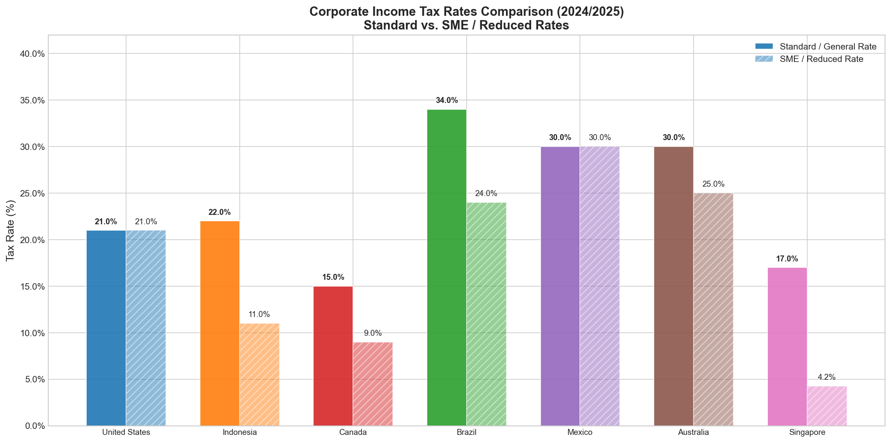

| Country | Standard Rate | SME / Reduced Rate | Key Mechanism |
|---|---|---|---|
| **Singapore** | **17%** flat | Effective **4.25%** on first S$10K | PTE (ITA S43A), SUTE (ITA S43B) |
| **United States** | **21%** flat | N/A (flat for all C-corps) | IRC S11(b), TCJA 2017 |
| **Canada** | **15%** federal | **9%** on first C$500K (CCPC) | ITA S125(1), SBD |
| **Indonesia** | **22%** | **0.5%** final on gross <=IDR 4.8B | UU 7/2021, PP 55/2022 |
| **Australia** | **30%** | **25%** (base rate entity <A$50M) | ITAA 1997 S23-10 |
| **Mexico** | **30%** flat | Border zone ~20% effective | LISR Art. 9, Decreto Fronteriza |
| **Brazil** | **34%** combined | Simples Nacional 4-33% | 25% IRPJ + 9% CSLL |

**Key takeaway:** Singapore (17%) and the US (21%) offer the lowest standard rates. Brazil (34%) and Mexico/Australia (30%) are the highest. However, effective rates diverge significantly once incentives are applied -- Singapore can reach 0% under Pioneer Status, and Indonesia offers 0% for up to 20 years through Tax Holidays.

### 1.2 Effective Rate Range (Lowest Achievable to Headline)

| Country | Lowest Achievable | Headline | Key Mechanism |
|---|---|---|---|
| **Singapore** | **0%** (Pioneer) | 17% | Pioneer Status (ITA S13(1)), SUTE (S43B) |
| **Indonesia** | **0%** (Tax Holiday) | 22% | PMK 130/2020 (5-20 year CIT exemption) |
| **Canada** | **9%** federal (CCPC SBD) | 15% federal | ITA S125(1) |
| **United States** | **21%** (flat) | 21% | No reduced rate; FDII at 13.125% for exports |
| **Australia** | **25%** (base rate entity) | 30% | ITAA 1997 S23-10 |
| **Mexico** | **~20%** (border zone) | 30% | Northern Border Zone ISR credit |
| **Brazil** | **~4%** (Simples lowest) | 34% | LC 123/2006 Simples Nacional |

### 1.3 Federal + State/Provincial Combined Rates

In countries with sub-national taxation, the combined rate matters more than the headline federal rate.

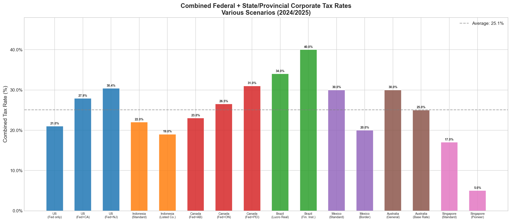

Notable examples:
- **US:** 21% federal + 0-11.5% state = 21-30.4% combined (California: 27.9%, New York: 26.7%)
- **Canada:** 15% federal + 8-16% provincial = 23-31% combined (Alberta: 23%, Ontario: 26.5%)
- **Australia:** 30% general + 0-6.85% state payroll = varies by state

---

## Part 2: Indirect Taxes (VAT / GST / Sales Tax)

Indirect taxes affect total cost of doing business and cash flow management.

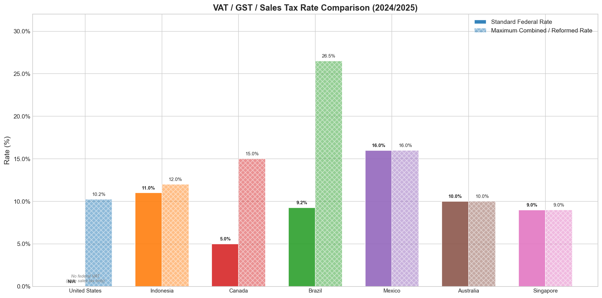

| Country | Tax Type | Standard Rate | Zero/Reduced Rates | Registration Threshold |
|---|---|---|---|---|
| **US** | State Sales Tax | 0-10.25% | Varies by state | State nexus rules |
| **Canada** | GST/HST | 5% GST / 13-15% HST | 0% on basic groceries, rx drugs, exports | C$30,000/4 quarters |
| **Indonesia** | PPN (VAT) | 11% (12% from 2025) | 0% on exports | IDR 4.8B/year |
| **Brazil** | PIS/COFINS + ICMS + ISS | 9.25% (non-cum.) + 7-25% ICMS | 0% on exports | Depends on regime |
| **Mexico** | IVA | 16% | 8% border zones; 0% food, medicine | All entities |
| **Australia** | GST | 10% | 0% basic food, health, education | A$75,000 |
| **Singapore** | GST | 9% (from Jan 2024) | 0% exports, international services | S$1,000,000 |

**Upcoming reforms:**
- **Indonesia**: PPN increase to 12% (January 2025)
- **Brazil**: CBS + IBS replacing PIS/COFINS/ICMS/ISS (transition 2026-2033)

---

## Part 3: Employer Payroll & Social Contributions

Payroll costs are often the second-largest expense after salaries. The range across jurisdictions is dramatic.

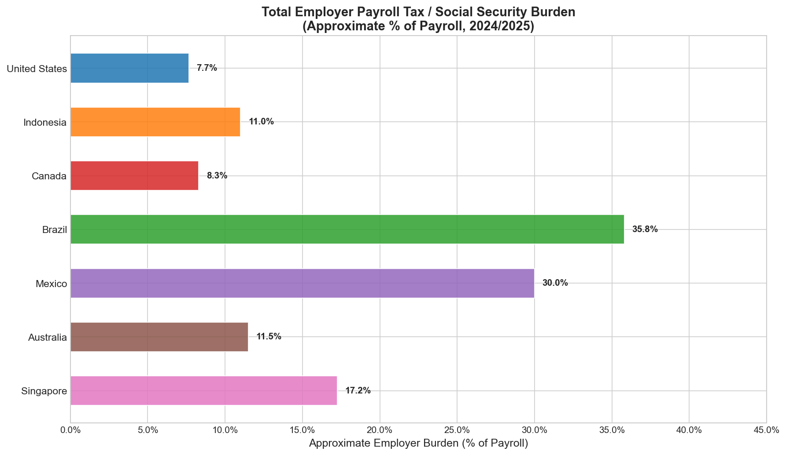

| Country | Approx. Employer Rate | Key Components |
|---|---|---|
| **United States** | ~7.65% | FICA: SS 6.2% + Medicare 1.45%; FUTA: 0.6% |
| **Canada** | ~7.7-11% | CPP: 5.95%; EI: 2.324%; provincial varies |
| **Indonesia** | ~11-15% | BPJS health 4%; BPJS TK pension 3.7%; JKK/JKM |
| **Australia** | ~11.5-16.5% | Super: 11.5% (12% from 2025-26); state payroll tax |
| **Singapore** | ~17.25% | CPF 17% (citizens/PRs only); SDL 0.25% |
| **Mexico** | ~26-35% | IMSS ~25%; Infonavit 5%; state payroll 2-3% |
| **Brazil** | ~35.8% | INSS 20%; FGTS 8%; Terceiros ~5.8%; RAT 1-3% |

**Critical insight:** Singapore's 17% CPF applies **only to citizens and permanent residents**. For foreign workers, employer contributions are effectively **0% CPF** (only SDL 0.25% + Foreign Worker Levy). This makes Singapore's effective payroll cost highly dependent on workforce composition.

### Australia Superannuation Rate Trajectory

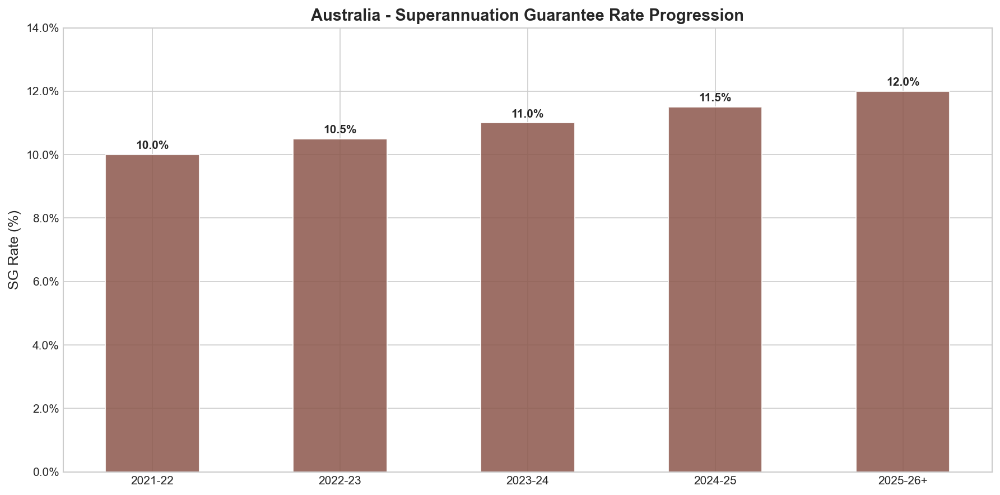

---

## Part 4: Depreciation & Capital Allowances

How quickly a business can write off capital investments directly affects after-tax cash flow and investment decisions.

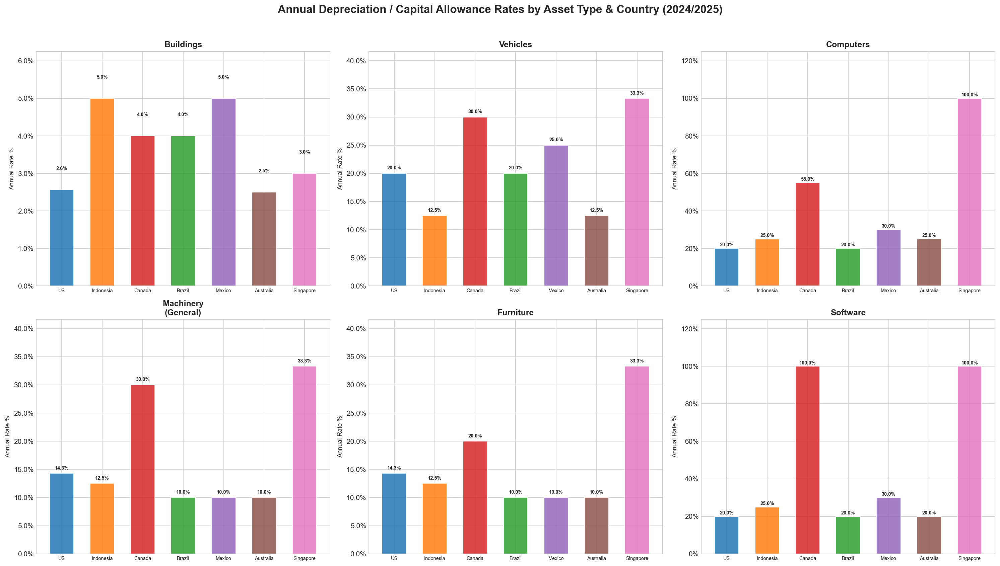

### Key Asset Recovery Periods

| Asset | US | Canada | Indonesia | Brazil | Mexico | Australia | Singapore |
|---|---|---|---|---|---|---|---|
| **Buildings** | 39yr SL | 4% DB | 20yr SL (5%) | 25yr SL (4%) | 20yr SL (5%) | 40yr SL (2.5%) | IA 25% + 3%/yr |
| **Machinery** | 7yr MACRS | 30% DB | 8yr SL (12.5%) | 10yr SL (10%) | 10yr SL (10%) | 10-15yr | 3yr SL (33%) |
| **Vehicles** | 5yr MACRS | 30% DB | 8yr SL (12.5%) | 5yr SL (20%) | 4yr SL (25%) | 8yr DV (25%) | 3yr SL (33%) |
| **Computers** | 5yr MACRS | 55% DB | 4yr SL (25%) | 5yr SL (20%) | 3.3yr SL (30%) | 4yr DV (50%) | **1yr (100%)** |
| **Software** | 3yr SL | 100% | 4yr SL (25%) | 5yr SL (20%) | N/A | 5yr DV (40%) | **1yr (100%)** |

### Immediate Expensing / Accelerated Write-Off

| Country | Mechanism | Limit |
|---|---|---|
| **Singapore** | Section 19A one-year write-off | **100% in year 1** (no cap) |
| **US** | Section 179 expensing | $1,220,000 (2024) |
| **US** | Bonus depreciation | 60% in 2024 (phasing down) |
| **Canada** | Immediate expensing for CCPCs | C$1,500,000/yr |
| **Indonesia** | Accelerated depreciation (priority sectors) | 2x rate |
| **Brazil** | Shift-based (2x for 3 shifts) | No dollar cap |
| **Australia** | Instant asset write-off (SBE) | A$20,000 per asset |

**Key insight:** Singapore and Canada offer the most generous immediate write-off provisions. Singapore allows 100% write-off of any qualifying plant and machinery in year 1 under ITA S19A with no dollar limit.

---

## Part 5: Net Operating Loss (NOL) Rules

The ability to carry losses forward (or back) determines how quickly a company can recover from loss-making periods.

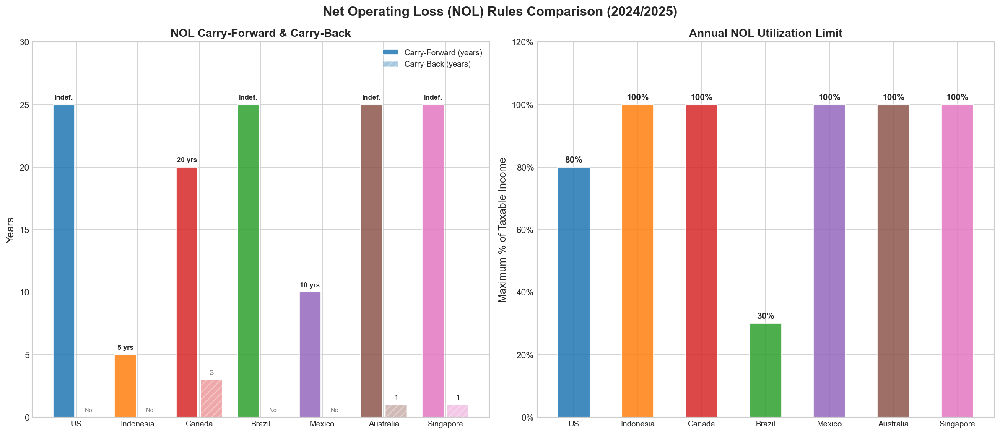

| Parameter | US | Canada | Indonesia | Brazil | Mexico | Australia | Singapore |
|---|---|---|---|---|---|---|---|
| **Carry-Forward** | Indefinite | 20 years | **5 years** | Indefinite | 10 years | Indefinite | Indefinite |
| **Carry-Back** | None | 3 years | None | None | None | 1 year | 1 year (S$100K cap) |
| **Annual Limit** | **80%** of TI | 100% | 100% | **30%** of TI | 100% | 100% | 100% |

**Critical observations:**
- **Brazil's 30% annual cap** is the most restrictive -- large accumulated losses take many years to absorb
- **Indonesia's 5-year expiry** can result in permanent loss of deductions during prolonged downturns
- **US 80% limit** means profitable corporations always pay some tax even with prior losses
- **Singapore, Australia, Canada** offer the most flexible NOL regimes

---

## Part 6: R&D Tax Incentives

R&D incentives can dramatically reduce effective tax rates for technology and innovation-intensive companies.

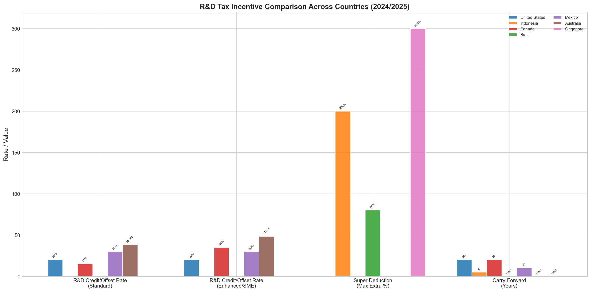

| Country | Type | Benefit Rate | Annual Cap |
|---|---|---|---|
| **Singapore** | Super deduction (EIS) | **400%** deduction (300% extra) | S$400K/activity |
| **Canada** | Tax credit (SR&ED ITC) | **35%** (CCPC, first C$3M); 15% (others) | C$3M expenditure limit |
| **Indonesia** | Super deduction | **300%** deduction (200% extra) | Approved activities only |
| **Australia** | Tax offset | +**18.5%** (<$20M, refundable); +8.5% (>=$20M) | A$150M notional deductions |
| **US** | Tax credit | **20%** regular; 14% simplified | No cap; 20yr carry-forward |
| **Brazil** | Super deduction (Lei do Bem) | **160-180%** deduction | Must be profitable |
| **Mexico** | Tax credit (EFIDT) | **30%** of incremental R&D | MXN 50M/yr |

### Effective R&D Benefit on $1M Spend

| Country | Tax Saving | Mechanism |
|---|---|---|
| **Indonesia** | $440,000 | 22% x $2M extra deduction |
| **Canada (CCPC)** | $350,000 | 35% refundable credit |
| **Singapore (EIS)** | $272,000 | 17% x $3M extra deduction |
| **US** | $200,000 | 20% tax credit |
| **Australia (<$20M)** | $185,000 | 43.5% refundable offset |
| **Brazil** | $204-272K | 34% x 60-80% extra deduction |
| **Mexico** | $90,000 | 30% of incremental |

**Key insights:**
- **Singapore's EIS** (400% deduction from YA 2024) is the most generous percentage deduction globally
- **Canada's SR&ED** is uniquely valuable for small CCPCs because the 35% credit is **refundable** -- the government pays cash even with no tax liability
- **The US** shifted R&D costs to **5-year mandatory amortization** (IRC S174) starting 2022, increasing after-tax R&D cost

---

## Part 7: Interest Deduction Limitations

Interest limitation rules affect how companies can use debt to fund operations and reduce tax.

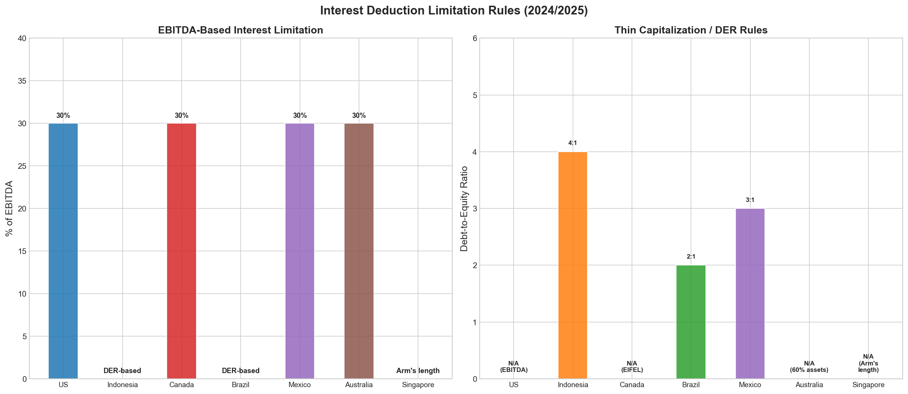

| Country | Primary Rule | Ratio/Limit |
|---|---|---|
| **Singapore** | **None** (arm's length only) | No fixed DER or EBITDA ratio |
| **Indonesia** | DER-based | **4:1** debt-to-equity |
| **Brazil** | DER-based | **2:1** (related parties); **0.3:1** (tax haven) |
| **Mexico** | DER + EBITDA | **3:1** DER + **30%** EBITDA |
| **US** | EBITDA-based | **30%** of adjusted taxable income |
| **Canada** | EBITDA-based (EIFEL) | **30%** of tax EBITDA |
| **Australia** | Transitioning to EBITDA | **30%** of tax EBITDA (from July 2024) |

**Key insight:** Singapore is uniquely permissive -- no thin capitalization rules and no EBITDA-based interest limitation. Interest deductions are only scrutinized under arm's length transfer pricing principles.

---

## Part 8: Withholding Taxes on Cross-Border Payments

Withholding taxes are the most direct cost of repatriating profits from a subsidiary to its parent.

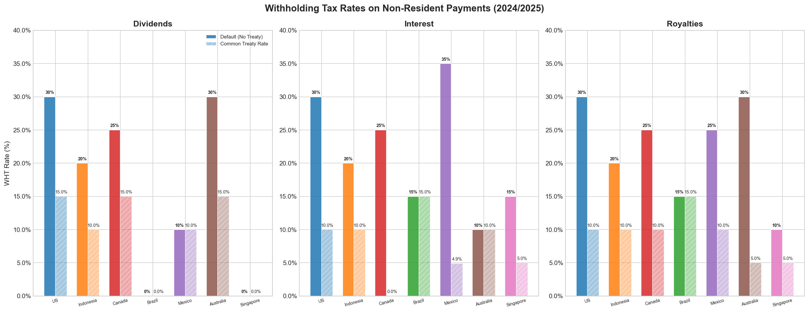

### Default Domestic WHT Rates (Non-Treaty)

| Payment Type | US | Canada | Indonesia | Brazil | Mexico | Australia | Singapore |
|---|---|---|---|---|---|---|---|
| **Dividends** | 30% | 25% | 20% | **0%** | 10% | 30% | **0%** |
| **Interest** | 30% | 25% | 20% | 15% | 35% | 10% | 15% |
| **Royalties** | 30% | 25% | 20% | 15% | 25% | 30% | 10% |

**Dividend WHT highlights:**
- **Singapore (0%)** and **Brazil (0%)** impose no WHT on dividends
- **Australia** effectively eliminates double taxation through the franking credit imputation system
- Treaty rates can significantly reduce the above defaults (e.g., US-Canada: 5% dividends)

---

## Part 9: Comprehensive Deduction & Incentive Overview

### 9.1 Deduction Categories Heatmap

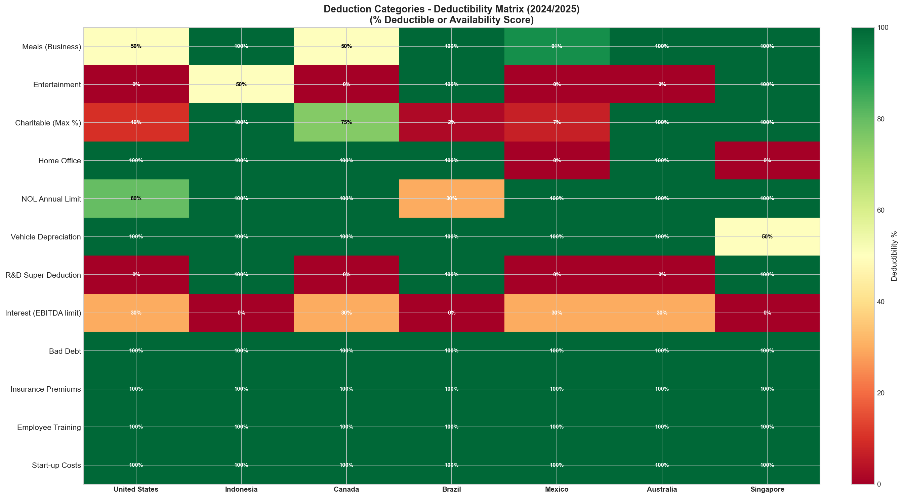

### 9.2 SME & Special Regimes

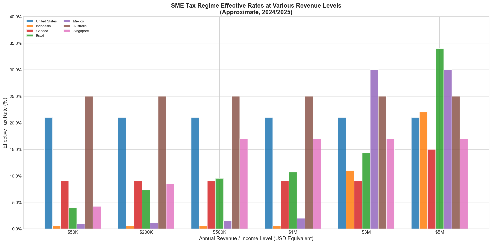

### 9.3 Brazil Simples Nacional Detail

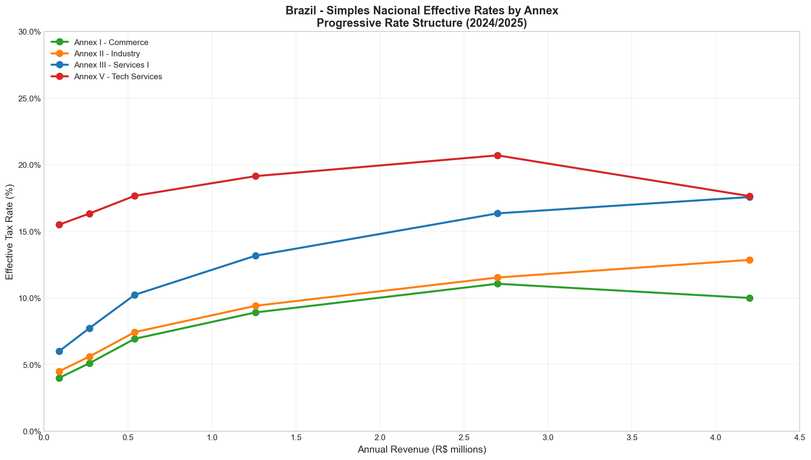

### 9.4 Overall Tax Burden Radar

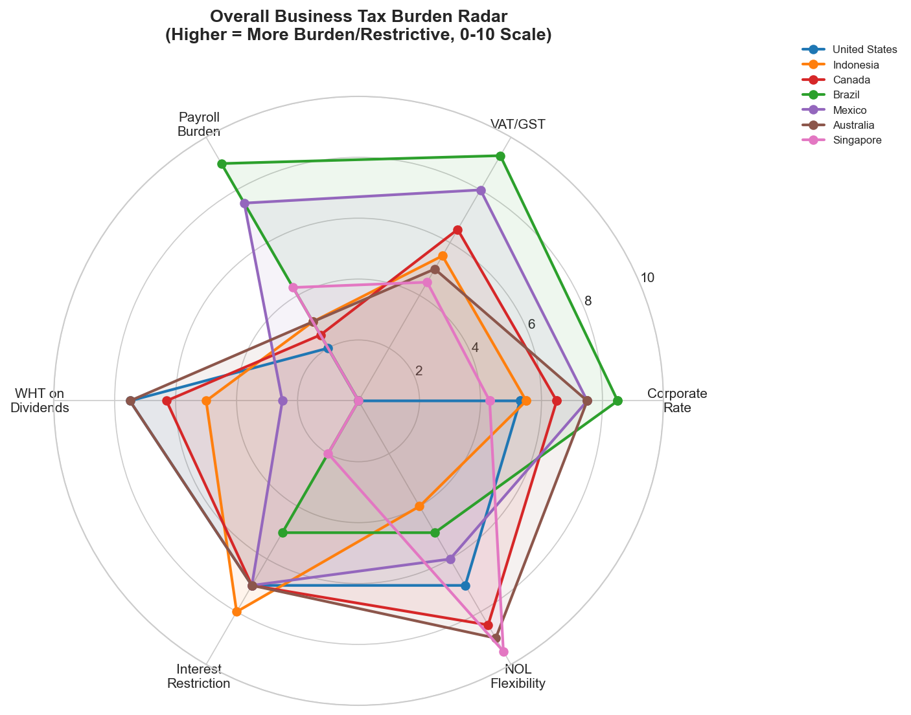

---

## Part 10: Country-Specific Incentive Deep Dives

### 10.1 Canada Provincial Rate Variation

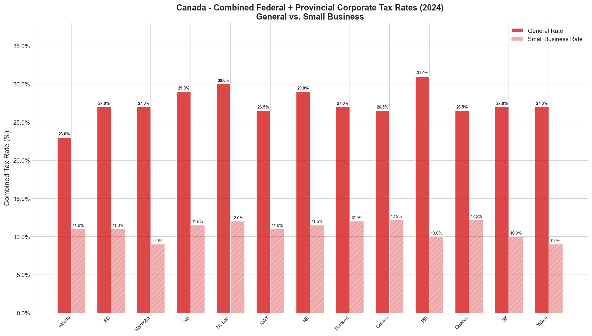

Alberta offers the lowest combined rate at 23% (8% provincial), while PEI is the highest at 31%.

### 10.2 Indonesia Tax Holiday Program

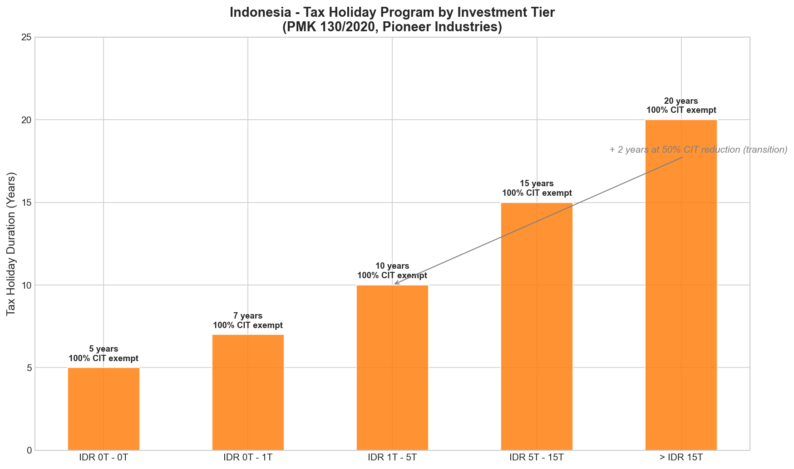

Indonesia's Tax Holiday (PMK 130/2020) offers **100% CIT exemption** for pioneer industries:

| Investment Amount (IDR) | Holiday Duration |
|---|---|
| 100B - 500B | 5 years |
| 500B - 1T | 7 years |
| 1T - 5T | 10 years |
| 5T - 15T | 15 years |
| >15T | 20 years |

Plus 2 additional years at 50% reduction after the holiday period.

### 10.3 Mexico RESICO (Simplified Trust Regime)

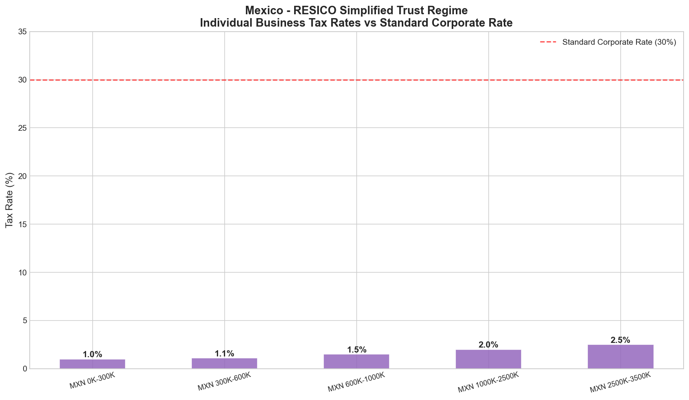

RESICO offers 1-2.5% rates for individuals with revenue up to MXN 3.5M. Combined with border zone incentives (~20% effective CIT + 8% IVA), Mexico provides compelling rates for specific structures.

### 10.4 Singapore Comprehensive Incentive Suite

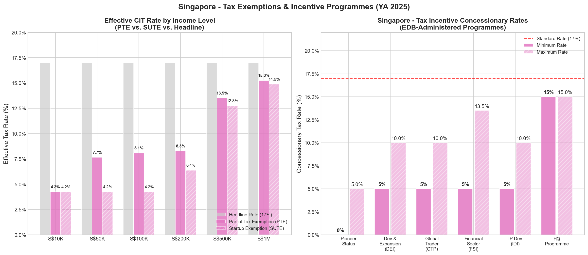

Singapore offers the broadest suite of concessionary tax regimes:

| Incentive | Rate | Duration |
|---|---|---|
| Pioneer Status (PS) | 0-5% | 5-15 years |
| Development & Expansion (DEI) | 5-10% | 5-10 years |
| Global Trader Programme (GTP) | 5-10% | Varies |
| Financial Sector (FSI) | 5-13.5% | Varies |
| IP Development (IDI) | 5-10% | Varies |
| Enterprise Innovation (EIS) | 400% R&D deduction | Ongoing |
| Startup Exemption (SUTE) | 75% exempt on first S$100K | First 3 YAs |

---

## Part 11: Non-Deductible Expenses

Understanding what **cannot** be deducted is as important as knowing what can.

| Expense Type | US | Canada | Indonesia | Brazil | Mexico | Australia | Singapore |
|---|---|---|---|---|---|---|---|
| **Entertainment** | 100% ND | 50% ded. | 50% ded. | Partially ND | 91.25% ded. | ND | **100% ded.** |
| **Meals (business)** | 50% ded. | 50% ded. | Generally ND | ND | 91.25% ded. | ND | **100% ded.** |
| **Fines & Penalties** | ND | ND | ND | ND | ND | ND | ND |
| **Charitable (excess)** | ND (>10% TI) | ND (>75% NI) | ND (>5% NI) | ND (>2% OP) | ND (>7% TI) | No cap | ND (beyond IPC) |

*ND = Non-Deductible, ded. = deductible*

**Key insight:** Singapore is the most permissive on entertainment and meal deductions -- 100% deductible for business purposes with no restriction. This contrasts sharply with the US (100% ND for entertainment post-2022).

---

## Part 12: Charitable Deductions

| Country | Deduction Limit | Multiplier | Carry-Forward |
|---|---|---|---|
| **Singapore** | No cap | **2.5x** (through 2026) | 5 years |
| **Australia** | **No cap** | 1x | 5 years |
| **Canada** | 75% of net income | 1x | 5 years |
| **US** | 10% of taxable income | 1x | 5 years |
| **Mexico** | 7% of prior year TI | 1x | None |
| **Indonesia** | 5% of net income (zakat) | 1x | None |
| **Brazil** | 2% of operating profit | 1x | None |

Singapore's 250% multiplier means every S$1 donated to an approved IPC generates **S$2.50** in deductions.

---

## Part 13: Transfer Pricing

### Framework Comparison

| Country | Standard | CbCR Threshold | Penalty (no documentation) |
|---|---|---|---|
| **US** | Arm's length + best method | $850M | 20-40% of underpayment |
| **Canada** | Arm's length | C$750M | 10% of adjustment |
| **Indonesia** | Arm's length | IDR 11T | Deemed income approach |
| **Brazil** | Arm's length (OECD-aligned 2024) | R$2.26B | 0.2%/month of revenue (up to 10%) |
| **Mexico** | Arm's length | MXN 12B | 55-75% of shortfall |
| **Australia** | Arm's length | A$1B (SGE) | 25-50% of shortfall |
| **Singapore** | Arm's length | S$1.125B | 5% surcharge + S$10K fine |

All seven jurisdictions follow the arm's length standard. Brazil's 2024 adoption of OECD-aligned rules (Lei 14.596/2023) was a major alignment shift.

---

## Part 14: BEPS Pillar 2 & International Tax

### 14.1 Global Minimum Tax (15%) Status

| Country | Status | Domestic Top-Up Tax | Implementation |
|---|---|---|---|
| **Singapore** | Implementing | Yes (from 2025) | Income Tax (Amendment) Act 2024 |
| **Australia** | Implementing | Yes (from 2025) | IIR from Jan 2024 |
| **Canada** | Implementing | QDMTT planned | Global Minimum Tax Act (Bill C-69) |
| **US** | Partial | No | GILTI at 10.5% serves similar purpose |
| **Indonesia** | Monitoring | Under consideration | No legislation yet |
| **Brazil** | Monitoring | Under consideration | No legislation yet |
| **Mexico** | Monitoring | Under consideration | No legislation yet |

### 14.2 Territorial vs. Worldwide Taxation

| Feature | US | Canada | Indonesia | Brazil | Mexico | Australia | Singapore |
|---|---|---|---|---|---|---|---|
| **System** | Worldwide | Worldwide | Worldwide | Worldwide | Worldwide | Worldwide | **Territorial** |
| **CFC Rules** | Yes (Subpart F + GILTI) | Yes (FAPI) | Yes (limited) | Yes (universal) | Yes (REFIPRE) | Yes (Part X) | **No** |
| **Tax Treaties** | 66+ | **94+** | 71+ | 35+ | 60+ | 45+ | **90+** |

**Singapore's territorial system** is a major differentiator -- foreign-sourced income is taxed only when remitted, with extensive exemptions for foreign dividends, branch profits, and service income under ITA S13(8)-(13).

---

## Part 15: International Investor Analysis

### 15.1 Foreign Investment Screening

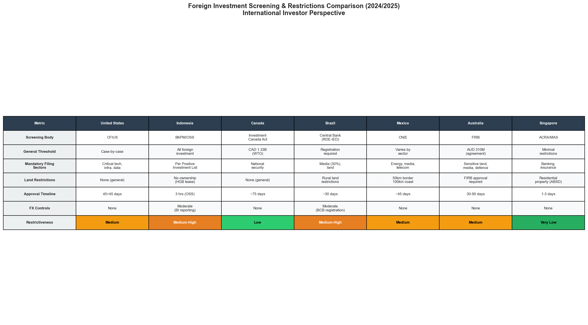

| Country | Screening Body | General Threshold | Approval Timeline |
|---|---|---|---|
| **Singapore** | ACRA/MAS | Minimal restrictions | **1-3 days** |
| **Indonesia** | BKPM/OSS-RBA | All foreign investment | ~3 hours (OSS) |
| **Canada** | Investment Canada Act | CAD 1.326B (WTO investors) | ~75 days |
| **US** | CFIUS | Case-by-case (mandatory for critical sectors) | 45 + 45 days |
| **Australia** | FIRB | AUD 310M (agreement countries) | 30-90 days |
| **Mexico** | CNIE | Varies by sector | ~45 days |
| **Brazil** | Central Bank (RDE-IED) | Registration required for all FDI | ~30 days |

### 15.2 Non-Resident Tax Rates

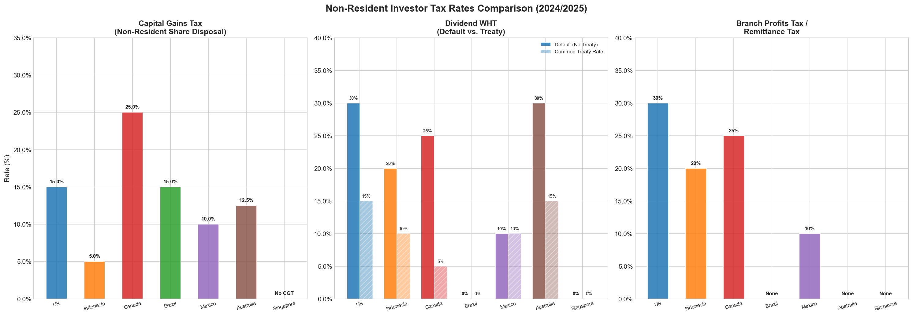

#### Capital Gains on Share Disposal

| Country | Listed Shares | Non-Listed Shares | Real Property |
|---|---|---|---|
| **Singapore** | **0%** | **0%** | **0%** (SSD may apply) |
| **Indonesia** | 0.1% final | 5% final (non-res) | 2.5% final |
| **Mexico** | 10% on gains | 10% on gains | 30% |
| **US** | 0% (non-USRPI) | 0% (non-USRPI) | 21% (FIRPTA) |
| **Canada** | 25% WHT (TCP) | 25% WHT (TCP) | 25% WHT (TCP) |
| **Australia** | 0% (non-TAP) | 0% (non-TAP) | 12.5% WHT |
| **Brazil** | 15% | 15% (25% tax haven) | 34% (corp) |

#### Dividend & Interest Treatment

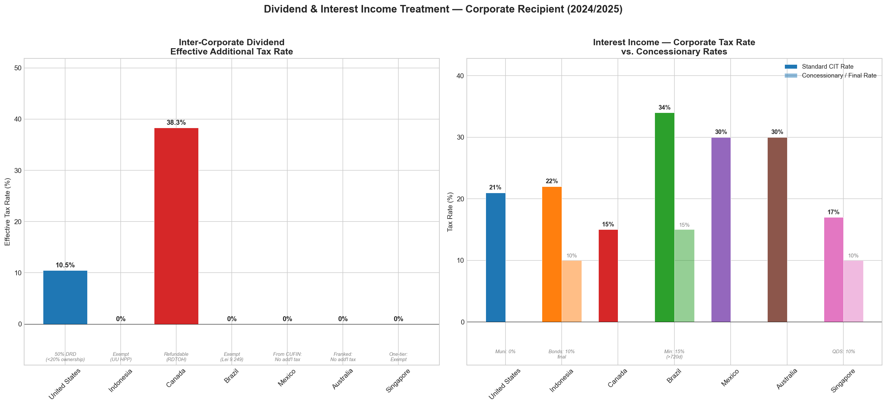

#### Capital Gains Comparison

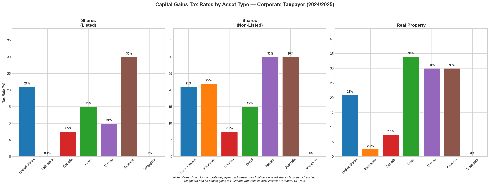

### 15.3 Repatriation Ease

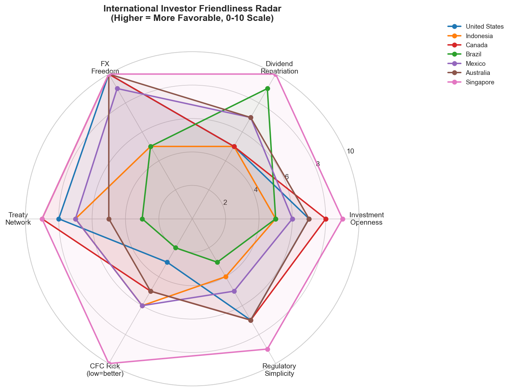

| Rank | Country | Score | Key Factors |
|---|---|---|---|
| 1 | **Singapore** | 10/10 | 0% dividend WHT, 0% branch tax, no FX controls |
| 2 | **Australia** | 9/10 | 0% on franked dividends, no FX controls |
| 3 | **US** | 8/10 | No FX controls, but 30% dividend WHT (treaty-reducible) |
| 3 | **Canada** | 8/10 | No FX controls, but 25% dividend WHT (treaty-reducible) |
| 5 | **Mexico** | 7/10 | No FX controls; 10% dividend WHT |
| 6 | **Brazil** | 6/10 | 0% dividend WHT but FX controls + BCB registration |
| 7 | **Indonesia** | 5/10 | 20% WHT, BI reporting, export proceeds restrictions |

### 15.4 Branch vs. Subsidiary

The choice between branch and subsidiary affects total tax cost, loss utilization, and access to incentives.

| Factor | Recommendation | Countries Where Branch May Work |
|---|---|---|
| **General rule** | **Subsidiary preferred** in all 7 countries | -- |
| **Loss-making phase** | Branch (to offset HO profits) | US, Canada |
| **No branch profits tax** | Branch viable | Brazil, Australia, Singapore |
| **Temporary project** | Branch (avoid incorporation costs) | All |

#### Combined Tax Rates (Branch vs. Subsidiary)

| Country | Branch Combined | Subsidiary Combined | Verdict |
|---|---|---|---|
| **Singapore** | **17%** | **17%** | Either works; sub preferred for PTE/SUTE |
| **Brazil** | **34%** | **34%** | Either works; 0% WHT either way |
| **Australia** | **30%** | **30%** (franked) | Sub preferred for franking benefits |
| **Canada** | 36.25% (ON) | 36.25% (ON) | Sub preferred for SBD eligibility |
| **US** | 44.7% | 44.7% | Sub preferred (treaty WHT reduction) |
| **Indonesia** | 37.6% | 37.6% | Sub preferred (treaty + incentives) |
| **Mexico** | 37% | 37% | Sub preferred (IMMEX eligible) |

---

## Part 16: CFC Rules Impact

CFC (Controlled Foreign Corporation) rules determine whether a parent country taxes its residents on undistributed foreign subsidiary profits.

| Severity Rank | Country | Regime | Notes |
|---|---|---|---|
| 1 (most aggressive) | **Brazil** | Universal CFC | Taxes ALL foreign subsidiary profits; no active income exemption |
| 2 | **US** | Subpart F + GILTI | Captures essentially all CFC income; 10.5% minimum effective |
| 3 | **Canada** | FAPI | Passive/services income; active business exempt |
| 4 | **Australia** | Part X | Tainted (passive) income; 95% active income safe harbor |
| 5 | **Mexico** | REFIPRE | Passive income in low-tax jurisdictions (<22.5%) |
| 6 | **Indonesia** | Deemed Dividend | Passive income; limited enforcement |
| 7 (none) | **Singapore** | **None** | No CFC rules; territorial system |

---

## Part 17: Key Investment Corridors

### 17.1 Singapore Parent -> Indonesian Subsidiary

| Step | Rate | Amount (on IDR 10B) |
|---|---|---|
| Indonesia CIT | 22% | IDR 2.2B |
| Dividend WHT (treaty) | 10% | IDR 780M (treaty: 390M) |
| Singapore CIT on dividend | 0% (FSIE exempt) | 0 |
| **Total effective rate** | **29.8%** | |

### 17.2 US Parent -> Canadian Subsidiary

| Step | Rate | Amount (on USD 10M) |
|---|---|---|
| Canada CIT (federal + ON) | 26.5% | CAD 2.65M |
| Dividend WHT (treaty) | 5% (>=10% ownership) | CAD 367.5K |
| US FTC on Canadian taxes | Credit offset | -- |
| **Total effective rate** | **~30.2%** | |

### 17.3 Singapore Parent -> Australian Subsidiary

| Step | Rate | Amount (on AUD 10M) |
|---|---|---|
| Australia CIT | 30% | AUD 3M |
| Franked dividend WHT | 0% | AUD 0 |
| Singapore CIT | 0% (FSIE exempt) | AUD 0 |
| **Total effective rate** | **30%** | Franking eliminates double tax |

### 17.4 Canada Parent -> Brazilian Subsidiary

| Step | Rate | Amount (on BRL 10M) |
|---|---|---|
| Brazil CIT (IRPJ + CSLL) | 34% | BRL 3.4M |
| Dividend WHT | 0% | BRL 0 |
| Canada CIT on dividend | 0% (exempt surplus) | BRL 0 |
| **Total effective rate** | **34%** | Brazil's high CIT is the full cost |

---

## Part 18: Sector-Specific Taxation

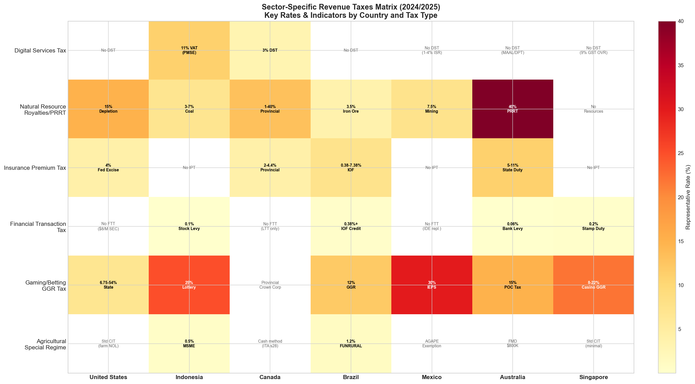

### Digital Services Taxation

| Country | DST? | Rate | Digital VAT/GST |
|---|---|---|---|
| **Canada** | **Yes** | 3% | GST/HST |
| **US** | No | -- | State sales tax |
| **Indonesia** | No (VAT-based) | -- | 11% PMSE VAT |
| **Brazil** | No | -- | ISS 2-5% |
| **Mexico** | No (ISR retention) | -- | 16% IVA |
| **Australia** | No (MAAL/DPT) | -- | 10% GST |
| **Singapore** | No (OVR GST) | -- | 9% GST OVR |

### Natural Resource Taxes

| Country | Key Mechanism | Rate |
|---|---|---|
| **Australia** | PRRT | **40%** (highest) |
| **Indonesia** | PNBP Royalties | Coal 3-7%, Gold 3.75% |
| **Canada** | Provincial royalties | AB: 1-40% oil & gas |
| **Mexico** | Ley Federal de Derechos | 7.5% EBITDA mining |
| **Brazil** | CFEM | Iron ore 3.5% |
| **US** | % Depletion | 5-22% |

---

## Part 19: Income Source Taxation

### Capital Gains -- Corporate Taxpayer

| Country | Listed Shares | Non-Listed Shares | Real Property |
|---|---|---|---|
| **Singapore** | **0%** (no CGT) | **0%** | **0%** (SSD applies) |
| **Indonesia** | 0.1% final | 22% | 2.5% final |
| **Mexico** | 10% | 30% | 30% |
| **Brazil** | 15% | 15% | 34% (corp) |
| **US** | 21% (full rate) | 21% | 21% |
| **Australia** | 30% (full rate) | 30% | 30% |
| **Canada** | 50% inclusion | 50% inclusion | 50% inclusion |

### Inter-Corporate Dividends

| Country | Domestic Dividends | Foreign Dividends | Mechanism |
|---|---|---|---|
| **Singapore** | Exempt (one-tier) | FSIE exempt | ITA S13(1)(za) |
| **Brazil** | Exempt | CFC: 34% | Lei 9.249 Art. 10 |
| **Indonesia** | Exempt (UU HPP) | Exempt if reinvested | Pasal 4(3)(f) |
| **US** | DRD 50/65/100% | S245A exempt (>=10%) | IRC S243, S245A |
| **Canada** | S112 deduction | Exempt surplus: 0% | ITA S112(1) |
| **Australia** | Franking credit | FTC (Div 770) | Div 207 |

---

## Part 20: Investor Decision Matrix

### 20.1 Scored Assessment (1-10, higher = more favorable)

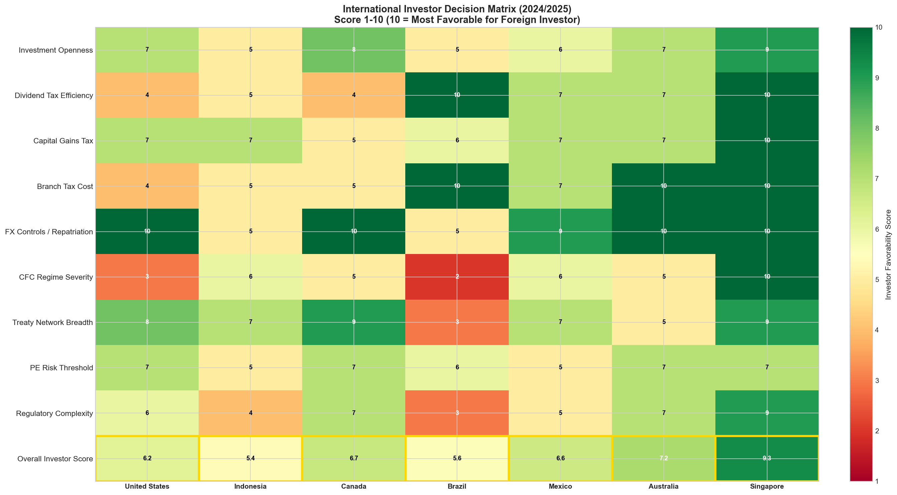

| Dimension | US | Indonesia | Canada | Brazil | Mexico | Australia | Singapore |
|---|---|---|---|---|---|---|---|
| **Investment Openness** | 7 | 5 | 8 | 5 | 6 | 7 | **9** |
| **Dividend Tax Efficiency** | 4 | 5 | 4 | **10** | 7 | 7 | **10** |
| **Capital Gains Tax** | 7 | 7 | 5 | 6 | 7 | 7 | **10** |
| **Branch Tax Cost** | 4 | 5 | 5 | **10** | 7 | **10** | **10** |
| **FX / Repatriation Ease** | **10** | 5 | **10** | 5 | 9 | **10** | **10** |
| **CFC Regime (low severity)** | 3 | 6 | 5 | 2 | 6 | 5 | **10** |
| **Treaty Network** | 8 | 7 | **9** | 3 | 7 | 5 | **9** |
| **PE Risk (low risk)** | 7 | 5 | 7 | 6 | 5 | 7 | 7 |
| **Regulatory Simplicity** | 6 | 4 | 7 | 3 | 5 | 7 | **9** |
| **Overall Score** | **6.2** | **5.4** | **6.7** | **5.6** | **6.6** | **7.2** | **9.3** |

### 20.2 Investor-Friendliness Ranking

| Rank | Country | Score | Best For |
|---|---|---|---|
| 1 | **Singapore** | 9.3 | Holding companies, regional HQ, IP holding, trading hubs |
| 2 | **Australia** | 7.2 | Franked dividend structures, mining/resources, R&D-intensive |
| 3 | **Canada** | 6.7 | SR&ED businesses, resource sector, US-adjacent operations |
| 4 | **Mexico** | 6.6 | Manufacturing (IMMEX/maquiladora), border zone incentives |
| 5 | **US** | 6.2 | Large market access, FDII incentive, technology sector |
| 6 | **Brazil** | 5.6 | 0% dividend WHT; but universal CFC + complexity offsets gains |
| 7 | **Indonesia** | 5.4 | Tax holidays (pioneer), ASEAN market access, natural resources |

---

## Part 21: Strategic Recommendations

### 21.1 Comprehensive Summary Table

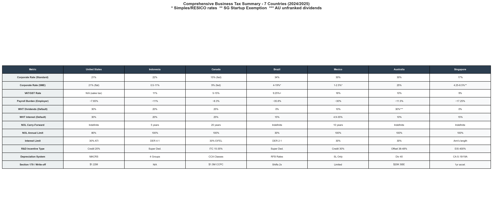

### 21.2 Summary Scorecard

| Category | US | Canada | Indonesia | Brazil | Mexico | Australia | Singapore |
|---|---|---|---|---|---|---|---|
| **CIT Competitiveness** | 3/5 | 4/5 | 4/5 | 2/5 | 2/5 | 3/5 | **5/5** |
| **R&D Incentives** | 3/5 | **5/5** | 4/5 | 3/5 | 2/5 | 4/5 | **5/5** |
| **Payroll Cost** | **5/5** | 4/5 | 4/5 | 2/5 | 2/5 | 3/5 | 4/5 |
| **Dividend Repatriation** | 2/5 | 3/5 | 3/5 | **5/5** | 3/5 | 4/5 | **5/5** |
| **NOL Flexibility** | 3/5 | 4/5 | 2/5 | 2/5 | 3/5 | **5/5** | **5/5** |
| **Interest Deductibility** | 3/5 | 3/5 | 4/5 | 3/5 | 3/5 | 3/5 | **5/5** |
| **Ease of Compliance** | 4/5 | 4/5 | 3/5 | 2/5 | 3/5 | 4/5 | **5/5** |
| **Treaty Network** | 4/5 | **5/5** | 4/5 | 2/5 | 4/5 | 3/5 | **5/5** |

### 21.3 Holding Company Jurisdiction Assessment

| Factor | Best | Worst | Rationale |
|---|---|---|---|
| **Dividend Repatriation** | Singapore (0%) / Brazil (0%) | US (30%) / Mexico (10%) | WHT on outbound dividends |
| **Treaty Network** | Canada (94+) / Singapore (90+) | Brazil (35+) | Treaty coverage breadth |
| **Interest Deductibility** | Singapore (no thin cap) | Brazil (2:1 DER) | Flexibility for leveraged structures |
| **R&D Hub** | Singapore (400% EIS) / Canada (35% ITC) | Mexico (limited) | Cash value of incentives |
| **Payroll Efficiency** | US (~7.65%) / Singapore (0% foreigners) | Brazil (~35.8%) | Total employer burden |

### 21.4 Risk Factors by Jurisdiction

| Country | Key Tax Risk | Mitigation |
|---|---|---|
| **US** | CAMT 15% for large corps; 5-year R&D amortization | Monitor legislation; stay below $1B AFSI |
| **Canada** | EIFEL 30% EBITDA limit on leveraged structures | Equity financing; group ratio election |
| **Indonesia** | Short 5-year NOL; frequent regulatory changes | Accelerate profit recovery; maintain documentation |
| **Brazil** | 30% NOL cap; complex multi-layer system | Regime selection (Lucro Presumido); use JCP |
| **Mexico** | High payroll (~30%); limited R&D incentives | RESICO for qualifying entities; border zone |
| **Australia** | New 30% EBITDA thin cap from 2024 | Structure as base rate entity (<$50M) |
| **Singapore** | Pillar 2 DMTT from 2025 erodes sub-15% rates | Recalibrated EDB incentives; RIC introduced |

---

## Part 22: Permanent Establishment Risk

| PE Type | US | Indonesia | Canada | Brazil | Mexico | Australia | Singapore |
|---|---|---|---|---|---|---|---|
| **Construction PE** | 12 months | **6 months** | 12 months | **6 months** | **6 months** | 12 months | 12 months |
| **Service PE** | N/A | **60 days** | 183 days | 183 days | 183 days | 183 days | 183 days |
| **Digital PE** | No | No | No | No | No | No (DPT 40%) | No |

**Risk ranking:**
- **High:** Indonesia (60-day service PE, aggressive enforcement)
- **Medium:** Brazil, Mexico (6-month construction PE)
- **Lower:** US, Canada, Australia, Singapore (clearer safe harbors)

---

## Part 23: Country Deep Dive — United States

> **Governing Law**: Internal Revenue Code (IRC), TCJA 2017, IRA 2022 | **Tax Authority**: IRS | **Currency**: USD

### 23.1 Corporate Income Tax Framework

| Parameter | Value | Legal Basis |
|---|---|---|
| Federal CIT rate | **21%** flat | IRC §11(b) |
| CAMT (large corps) | **15%** on AFSI ≥ $1B (3yr avg) | IRC §55 (IRA 2022) |
| State CIT range | 0% (NV, WY, SD) to 11.5% (NJ) | State statutes |
| Combined range | 21% (no state) to 30.4% (NJ) | Federal + state |
| GILTI rate | 10.5% effective (50% §250 deduction) | IRC §951A, §250(a)(1)(B) |
| FDII rate | 13.125% effective (37.5% §250 deduction) | IRC §250(a)(1)(A) |
| BEAT rate | 10% (12.5% banks/dealers) | IRC §59A |
| BEAT threshold | Gross receipts ≥ $500M (3yr) + base erosion >3% | IRC §59A(e) |

**Pass-Through Taxation**: S-corps and partnerships taxed at individual rates (10-37%). QBI deduction under IRC §199A provides 20% deduction on qualified business income (sunsets after 2025).

### 23.2 Key Deductions & Allowances

**Depreciation (MACRS — IRC §168)**

| Property Class | Period | Method | Example Assets |
|---|---|---|---|
| 3-year | 3 yr | 200% DB | Tractor units, racehorses |
| 5-year | 5 yr | 200% DB | Autos, computers, office equipment |
| 7-year | 7 yr | 200% DB | Furniture, fixtures, agricultural machinery |
| 15-year | 15 yr | 150% DB | Land improvements, QIP |
| 27.5-year | 27.5 yr | SL | Residential rental |
| 39-year | 39 yr | SL | Nonresidential real property |

| Accelerated Mechanism | 2024 Value | Legal Basis |
|---|---|---|
| Section 179 expensing | **$1,220,000** (phase-out at $3.05M) | IRC §179 |
| Bonus depreciation | **60%** (phasing: 40% in 2025, 20% in 2026, 0% from 2027) | IRC §168(k) |
| Luxury auto limit (Yr 1 w/ bonus) | $20,400 | IRC §280F(a) |

**Net Operating Losses (IRC §172)**

| Parameter | Value |
|---|---|
| Carry-forward | **Indefinite** (IRC §172(b)(1)(A)) |
| Carry-back | **None** (post-2020 losses) |
| Annual limit | **80%** of taxable income (IRC §172(a)(2)) |
| Farm NOL carry-back | 2 years (IRC §172(b)(1)(B)) |

**Business Interest Limitation (IRC §163(j))**

| Parameter | Value |
|---|---|
| Limit | **30%** of ATI (≈ EBIT from 2022+) |
| Carry-forward | Indefinite |
| Exemption | Avg. gross receipts ≤ $29M (2024, indexed) |
| Exempt industries | Electing real property, farming, regulated utilities |

**R&D (IRC §41 + §174)**

| Parameter | Value |
|---|---|
| Regular credit | **20%** of QREs exceeding base amount |
| Alt. Simplified Credit | **14%** of QREs exceeding 50% of prior 3yr avg |
| Payroll tax offset | Up to $500K/yr (small business) |
| **Amortization (post-2022)** | Domestic: **5 years**; Foreign: **15 years** (IRC §174) |

**Other Key Deductions**

| Item | Rule | Legal Basis |
|---|---|---|
| Charitable contributions | **10%** of taxable income | IRC §170(b)(2)(A) |
| Business meals | **50%** deductible | IRC §274(k), §274(n)(1) |
| Entertainment | **0%** (non-deductible) | IRC §274(a)(1) |
| Executive comp (public co.) | $1M cap per covered employee | IRC §162(m) |
| Energy ITC (Solar) | **30%** through 2032 | IRA 2022 |
| Carbon capture (45Q) | **$85/ton** (direct) / **$180/ton** (DAC) | IRC §45Q |

### 23.3 International Investor Framework

**CFIUS Screening (FIRRMA 2018, 50 USC §4565)**

| Filing Type | Trigger | Timeline |
|---|---|---|
| Mandatory declaration | ≥25% in TID US business w/ foreign gov't | 30-day assessment |
| Voluntary notice | Any covered transaction | 45-day review + 45-day investigation |
| Presidential block | National security threat | 15-day decision |

**Sector Restrictions**

| Sector | Cap | Governing Law |
|---|---|---|
| Airlines | **25%** voting | 49 USC §40102(a)(2) |
| Broadcasting | **25%** voting | 47 USC §310(b) |
| Shipping (Jones Act) | **75%** US-citizen owned | 46 USC §55102 |
| Nuclear energy | No foreign control | 42 USC §2133(d) |
| Defense | FOCI mitigation required | NISPOM 32 CFR Part 117 |

**Non-Resident Taxation**

| Item | Rate | Legal Basis |
|---|---|---|
| FIRPTA (USRPHC shares) | **21%** on net gain; **15%** withholding | IRC §897, §1445 |
| Non-USRPHC shares | **0%** (not taxable) | IRC §871(a)(2) |
| Dividend WHT | **30%** (treaty: 5-15%) | IRC §1441, §1442 |
| Branch profits tax | **30%** on DEA (treaty: 5%) | IRC §884 |
| Interest WHT | **30%** (portfolio interest: 0%) | IRC §871(h), §881(c) |

**CFC Rules: Subpart F (IRC §951-964) + GILTI (IRC §951A)**

| Parameter | Subpart F | GILTI |
|---|---|---|
| CFC definition | >50% US shareholders (each ≥10%) | Same |
| Income captured | Passive (FPHCI), base company sales/services | All tested income minus 10% QBAI |
| Effective US rate | Up to 21% | 10.5% (13.125% after 2025) |
| FTC | 100% of foreign taxes | 80% of foreign taxes |
| High-tax exclusion | Effective rate ≥ 18.9% → exclude | Same (Treas. Reg. §1.951A-2(c)(7)) |

**Key Treaty WHT Rates (From US)**

| Partner | Dividends (Direct/Portfolio) | Interest | Royalties |
|---|---|---|---|
| Canada | 5% / 15% | 0% | 0% |
| UK | 0% (≥80%) / 15% | 0% | 0% |
| Japan | 5% / 10% | 10% | 0% |
| Germany | 5% / 15% | 0% | 0% |
| Australia | 5% / 15% | 10% | 5% |
| Singapore | 5% / 15% | 12% | 0% |
| Mexico | 5% / 10% | 15% | 10% |
| China | 10% / 10% | 10% | 10% |

---

## Part 24: Country Deep Dive — Singapore

> **Governing Law**: Income Tax Act 1947 (ITA, Cap. 134) | **Tax Authority**: IRAS | **Currency**: SGD

### 24.1 Corporate Income Tax Framework

| Parameter | Value | Legal Basis |
|---|---|---|
| Standard CIT | **17%** | ITA §43(1)(a) |
| System | **Territorial** (foreign-source income taxed only when remitted, with broad exemptions) | ITA §10(1) |
| Capital gains tax | **0%** (no CGT regime) | N/A |
| PTE (all companies) | 75% exempt on first S$10K + 50% on next S$190K | ITA §43A |
| SUTE (first 3 YAs) | 75% exempt on first S$100K + 50% on next S$100K | ITA §43B |
| Effective rate (S$200K profit) | **~8.3%** (with PTE) | |

**Concessionary Tax Regimes**

| Incentive | Rate | Duration | Administering Body |
|---|---|---|---|
| Pioneer Status (PS) | **0-5%** | 5-15 years | EDB |
| Development & Expansion (DEI) | **5-10%** | 5-10 years | EDB |
| Global Trader Programme (GTP) | **5-10%** | Varies | IE Singapore |
| Financial Sector (FSI) | **5-13.5%** | Varies | MAS |
| IP Development (IDI) | **5-10%** | Varies | EDB |
| Enterprise Innovation (EIS) | **400%** R&D deduction | Ongoing | EDB |

### 24.2 Key Deductions & Allowances

**Capital Allowances (ITA §19, §19A)**

| Mechanism | Rate | Notes |
|---|---|---|
| Section 19A write-off | **100%** in year 1 | No dollar cap; all qualifying P&M |
| 3-year write-off | 33%/33%/34% | Alternative option |
| Section 19B IP WDA | Over 5/10/15 years | Writing-down allowance for IP |
| Renovation (S14Q) | **S$300,000** cap per 3-year period | Interior renovation |

**NOL Rules (ITA §37)**

| Parameter | Value |
|---|---|
| Carry-forward | **Indefinite** |
| Carry-back | 1 year, **S$100,000** cap |
| Annual limit | **100%** of taxable income |
| Shareholding test | >50% same shareholders |

**R&D Incentives**

| Scheme | Benefit | Legal Basis |
|---|---|---|
| Section 14C (R&D deduction) | **100%** deduction | ITA §14C |
| EIS (from YA2024) | **400%** deduction (300% additional) | EDB scheme |
| EIS cap | **S$400,000** per qualifying activity | |

**Interest & Thin Capitalization**

| Parameter | Value |
|---|---|
| Interest deduction | Fully deductible if for income production | ITA §14(1)(a) |
| Thin cap rules | **None** |
| EBITDA limitation | **None** |
| Arm's length requirement | Transfer pricing only (ITA §34D) |

**Other Deductions**

| Item | Rule |
|---|---|
| Donations (IPCs) | **2.5x multiplier** through 2026; no cap |
| Business entertainment | **100%** deductible |
| Business meals | **100%** deductible |

### 24.3 International Investor Framework

| Feature | Detail |
|---|---|
| Foreign ownership restrictions | **Virtually none** (exceptions: media, banking, residential property) |
| Registration | ACRA; **1-3 days** |
| Dividend WHT | **0%** (one-tier system, ITA §13(1)(za)) |
| Capital gains tax | **0%** on all assets |
| Branch profits tax | **0%** |
| CFC rules | **None** |
| FX controls | **None** |
| Tax treaties | **90+** comprehensive DTAs |

**FSIE (Foreign-Sourced Income Exemption — ITA §13(8)-(13))**

Foreign-source dividends, branch profits, and service income are exempt from Singapore tax when remitted if:
1. Income was subject to tax in the source country (headline rate ≥ 15%)
2. The exemption is "beneficial to the taxpayer"

**BEPS Pillar 2 Impact**

| Parameter | Value |
|---|---|
| Implementation | DMTT from **January 1, 2025** |
| Mechanism | Domestic top-up tax (QDMTT) |
| Impact | Concessionary rates below 15% will be topped up |
| Mitigation | Refundable Investment Credit (RIC) introduced |

**Key Treaty WHT Rates (From Singapore)**

| Partner | Dividends | Interest | Royalties |
|---|---|---|---|
| Indonesia | 10% | 10% | 10% |
| Australia | 15% | 10% | 10% |
| China | 5% | 10% | 10% |
| India | 10% | 15% | 10% |
| Japan | 5% | 10% | 10% |
| UK | 0% | 0% | 0% |
| Germany | 5% | 0% | 0% |

---

## Part 25: Country Deep Dive — Indonesia

> **Governing Law**: UU 7/2021 (HPP), UU 36/2008 (PPh) | **Tax Authority**: DJP/DGT | **Currency**: IDR

### 25.1 Corporate Income Tax Framework

| Parameter | Value | Legal Basis |
|---|---|---|
| Standard CIT | **22%** | UU 7/2021 Pasal 17 |
| Listed company discount | **19%** (3% reduction for ≥40% public float) | PP 30/2020 |
| MSME rate | **0.5%** final on gross revenue ≤IDR 4.8B | PP 55/2022 |
| Tax Holiday (pioneer) | **100%** CIT exemption for 5-20 years | PMK 130/2020 |
| Tax Allowance | **30%** investment deduction over 6 years (5% p.a.) | PP 78/2019 |

**Tax Holiday Tiers (PMK 130/2020)**

| Investment (IDR) | Duration | Post-Holiday |
|---|---|---|
| 100B - 500B | 5 years | +2 years at 50% reduction |
| 500B - 1T | 7 years | +2 years at 50% |
| 1T - 5T | 10 years | +2 years at 50% |
| 5T - 15T | 15 years | +2 years at 50% |
| >15T | 20 years | +2 years at 50% |

### 25.2 Key Deductions & Allowances

**Depreciation (UU 36/2008 Pasal 11)**

| Group | SL Rate | DV Rate | Useful Life |
|---|---|---|---|
| Group 1 | 25% | 50% | 4 years |
| Group 2 | 12.5% | 25% | 8 years |
| Group 3 | 6.25% | 12.5% | 16 years |
| Group 4 | 5% | 10% | 20 years |
| Buildings (permanent) | 5% | N/A | 20 years |
| Buildings (non-permanent) | 10% | N/A | 10 years |

**NOL (UU 36/2008 Pasal 6)**

| Parameter | Value |
|---|---|
| Carry-forward | **5 years** (extendable to 10 for specific sectors/regions) |
| Carry-back | **Not allowed** |
| Annual limit | **100%** of taxable income |

**R&D Super Deduction (PMK 153/2020)**: **300%** (200% additional) for approved R&D activities in priority sectors.

**Interest Limitation (PMK 169/2015)**: DER **4:1** (debt-to-equity) for related-party debt.

### 25.3 WHT Regime

| Payment | Domestic (PPh 23) | International (PPh 26) | Treaty (typical) |
|---|---|---|---|
| Dividends | 0% (if reinvested, UU HPP) | 20% | 10-15% |
| Interest | 15% | 20% | 10% |
| Royalties | 15% | 20% | 10% |
| Services | 2% | 20% | 0-10% |

**Key Treaty Rates (From Indonesia)**

| Partner | Dividends | Interest | Royalties |
|---|---|---|---|
| Singapore | 10% | 10% | 10% |
| Japan | 10% | 10% | 10% |
| Netherlands | 10% | 10% | 10% |
| US | 10% | 10% | 10% |
| Australia | 15% | 10% | 10-15% |
| Hong Kong | 5% | 10% | 5% |

### 25.4 International Investor Framework

| Feature | Detail |
|---|---|
| Investment system | Positive Investment List (Perpres 10/2021); OSS-RBA ~3 hours |
| Foreign ownership | Up to **100%** in most sectors (post-2021 reform) |
| CFC rules | Deemed Dividend for ≥50% ownership (PMK 107/2017) |
| FTC | Per-country; **no carry-forward** (UU 36/2008 Pasal 24) |
| PE risk | **High**: 18 PE categories; 60-day service PE; aggressive enforcement |
| Treaties | **71+** comprehensive DTAs |
| DGT Form | Required for treaty benefits; 12-month validity (PER-25/PJ/2018) |

---

## Part 26: Country Deep Dive — Canada

> **Governing Law**: Income Tax Act (ITA), R.S.C. 1985 | **Tax Authority**: CRA | **Currency**: CAD

### 26.1 Corporate Income Tax Framework

| Parameter | Value | Legal Basis |
|---|---|---|
| Federal CIT | **15%** | ITA §123(1) |
| SBD (CCPC, first C$500K) | **9%** | ITA §125(1) |
| M&P deduction | **13%** federal | ITA §125.1 |
| Provincial CIT | **8-16%** | Provincial statutes |
| Combined (Alberta) | **23%** (lowest) | |
| Combined (Ontario) | **26.5%** | |
| Combined (PEI) | **31%** (highest) | |

**GST/HST**: 5% GST (ETA §165(1)); HST 13-15% in participating provinces. Registration: C$30,000/4 quarters.

### 26.2 Key Deductions & Allowances

**Capital Cost Allowance (CCA)**

| CCA Class | Rate | Method | Assets |
|---|---|---|---|
| Class 1 | **4%** | DV | Buildings |
| Class 8 | **20%** | DV | Equipment, furniture |
| Class 10 | **30%** | DV | Vehicles |
| Class 12 | **100%** | SL | Software, tools <$500 |
| Class 43.1 | **30%** | DV | Clean energy equipment |
| Class 43.2 | **50%** | DV | Enhanced clean energy |
| Class 50 | **55%** | DV | Computers |
| Class 53 | **50%** | DV | Manufacturing equipment |
| CCPC immediate expensing | **C$1,500,000/yr** | | Eligible depreciable property |

**Accelerated Investment Incentive Program (AIIP)**: Enhanced first-year deduction (1.5x normal CCA rate in year of acquisition) for most CCA classes.

**NOL (ITA §111)**

| Parameter | Value |
|---|---|
| Carry-forward | **20 years** |
| Carry-back | **3 years** |
| Annual limit | **100%** of taxable income |

**SR&ED (ITA §127(5)-(26))**

| Parameter | CCPC | Other Corporations |
|---|---|---|
| ITC rate | **35%** (refundable) | **15%** (non-refundable) |
| Expenditure limit | First C$3M of qualifying expenditures | No limit |
| Carry-forward | 20 years | 20 years |
| Carry-back | 3 years | 3 years |
| Eligible expenditures | Wages, materials, overhead, contracts | Same |

**Interest Limitation (EIFEL — ITA §18.2)**

| Parameter | Value |
|---|---|
| Limit | **30%** of tax EBITDA |
| Effective | June 2023 (transitional) |
| Carry-forward | Denied interest: indefinite; unused capacity: 3 years |
| Group ratio election | Available |
| Exemption | CCPC groups with net interest ≤ C$250,000 |

### 26.3 WHT Regime (Part XIII — ITA §212)

| Payment | Default | US Treaty | UK Treaty |
|---|---|---|---|
| Dividends (≥10% ownership) | 25% | **5%** | **5%** |
| Dividends (portfolio) | 25% | **15%** | **15%** |
| Interest (arm's length) | **0%** | 0% | 0% |
| Royalties | 25% | **0-10%** | **0-10%** |
| Branch tax | 25% | **5%** | **5%** |

### 26.4 International Investor Framework

**Investment Canada Act (ICA)**

| Parameter | Value |
|---|---|
| Net benefit review | C$1.326B (WTO investors); C$512M (non-WTO) |
| National security review | Any amount (no threshold) |
| Cultural sector | Lower thresholds; Heritage Canada review |
| Restricted sectors | Telecom (Telecommunications Act §16); airlines (CTA §55); banking (Bank Act §372-374); uranium |

**CFC Rules: FAPI (ITA §91-95)**

| Parameter | Value |
|---|---|
| CFC definition | Canadian taxpayer holds ≥10% equity in FA; control ≥50% |
| FAPI income | Passive income (interest, dividends, rents, royalties, capital gains) |
| Active business income | **Exempt** from FAPI |
| Exempt surplus | Active business income in **treaty country** → 0% Canadian tax on dividends |
| Taxable surplus | Active income in non-treaty country → grossed-up and taxed with underlying FTC |
| Capital gains inclusion | Changing to **66.67%** (from 50%) for amounts over C$250K (June 25, 2024) |

**FTC (ITA §126)**

| Type | Carry-Forward | Carry-Back |
|---|---|---|
| Business income | 10 years | 3 years |
| Non-business income | **None** (use it or lose it) | None |

---

## Part 27: Country Deep Dive — Brazil

> **Governing Law**: RIR/2018 (Decreto 9.580), Lei 9.249/1995 | **Tax Authority**: RFB | **Currency**: BRL

### 27.1 Corporate Income Tax Framework

| Tax | Rate | Legal Basis |
|---|---|---|
| IRPJ (standard) | **15%** | RIR Art. 225 |
| IRPJ surtax | **10%** on profit > R$240K/yr (R$20K/month) | RIR Art. 228 |
| CSLL | **9%** | Lei 7.689/1988 |
| **Combined effective** | **34%** | |

**Tax Regimes**

| Regime | Eligibility | Mechanism |
|---|---|---|
| Lucro Real | Revenue >R$78M or mandatory sectors | Tax on actual net profit |
| Lucro Presumido | Revenue ≤R$78M | Presumed profit: 8% (general), 32% (services) × tax rates |
| Simples Nacional | Revenue ≤R$4.8M (LC 123/2006) | Single simplified tax (4-33% on gross revenue) |

**Indirect Taxes**

| Tax | Rate | Scope |
|---|---|---|
| PIS/COFINS (non-cumulative) | **9.25%** (1.65% + 7.6%) | Lucro Real entities |
| PIS/COFINS (cumulative) | **3.65%** (0.65% + 3%) | Lucro Presumido entities |
| ICMS (state VAT) | **7-25%** (typical 17-18%) | Goods circulation |
| ISS (municipal) | **2-5%** | Services |
| IPI (federal excise) | Varies by product | Manufactured goods |

**Upcoming Reform**: CBS + IBS replacing PIS/COFINS/ICMS/ISS (transition 2026-2033).

### 27.2 Key Deductions & Allowances

**Depreciation (straight-line only)**

| Asset | Rate | Useful Life |
|---|---|---|
| Buildings | **4%** | 25 years |
| Machinery | **10%** | 10 years |
| Vehicles | **20%** | 5 years |
| Computers | **20%** | 5 years |
| Shift acceleration | 1.5x (2 shifts), 2x (3 shifts) | No dollar cap |

**NOL**

| Parameter | Value |
|---|---|
| Carry-forward | **Indefinite** |
| Carry-back | **None** |
| Annual cap | **30%** of taxable income (most restrictive globally) |

**Interest on Net Equity (JCP — Lei 9.249/1995 Art. 9)**

| Parameter | Value |
|---|---|
| Rate | TJLP (currently ~12.5% p.a.) applied to net equity |
| Tax benefit (payer) | Deductible → saves **34%** |
| WHT (recipient) | **15%** (25% if tax haven) |
| **Net benefit** | 34% - 15% = **19%** tax savings |

**R&D (Lei do Bem — Lei 11.196/2005)**

| Parameter | Value |
|---|---|
| Super deduction | **160%** base (60% additional) |
| Enhanced | **180%** if patents obtained (80% additional) |
| Requirement | Entity must be on **Lucro Real** and **profitable** |

**Thin Capitalization (Lei 12.249/2010)**

| Parameter | Value |
|---|---|
| Related-party debt | **2:1** DER |
| Tax haven entities | **0.3:1** DER |
| Excess interest | **Non-deductible** |

### 27.3 International Investor Framework

| Feature | Detail |
|---|---|
| Foreign ownership | Generally unrestricted; exceptions: media (30% cap, CF Art. 222), healthcare, border zones |
| FDI registration | BCB RDE-IED required for all FDI |
| Dividend WHT | **0%** (Lei 9.249/1995 Art. 10) — unique global advantage |
| Interest WHT | **15%** (25% tax haven) |
| CIDE (technology) | **10%** on royalty/technology remittances (Lei 10.168/2000) |
| CFC regime | **Universal** — ALL foreign subsidiary profits taxed (Lei 12.973/2014 Arts. 76-92) |
| Active income exemption | **None** — most aggressive CFC regime globally |
| Transfer pricing | **OECD-aligned** from Jan 2024 (Lei 14.596/2023) |
| Treaties | **35+** (limited network; notably missing: US, UK, Germany, Australia) |
| FX controls | BCB registration; IOF on FX transactions |

**JCP Optimization Strategy**: Use Interest on Net Equity instead of dividends:
- Dividend: 0% WHT but no deduction for payer → 34% CIT paid
- JCP: 15% WHT but **34% deduction** for payer → net 15% cost vs 34%
- **Savings**: 19 percentage points on repatriated profits

---

## Part 28: Country Deep Dive — Mexico

> **Governing Law**: LISR, CFF, LIE | **Tax Authority**: SAT | **Currency**: MXN

### 28.1 Corporate Income Tax Framework

| Parameter | Value | Legal Basis |
|---|---|---|
| Standard CIT | **30%** flat | LISR Art. 9 |
| Northern Border Zone | ~**20%** effective (ISR credit) | Decreto Fronteriza |
| RESICO (individuals) | **1-2.5%** on revenue ≤MXN 3.5M | LISR Art. 113-E |
| PTU (employee profit share) | **10%** of taxable profit | LFT Arts. 117-131 |
| PTU cap per employee | Greater of: 3 months' salary OR avg PTU of last 3 years | LFT Art. 127 fr. VIII |

**IVA**: 16% standard (LIVA Art. 1); 8% border zone; 0% on food, medicine, exports.

**Payroll Burden**: IMSS ~25% + INFONAVIT 5% + state payroll 2-3% + SAR 2% = **~26-35% total**.

### 28.2 Key Deductions & Allowances

**Depreciation (LISR Art. 31-38) — Straight-line only**

| Asset | Max Rate | Legal Basis |
|---|---|---|
| Buildings (commercial) | **5%** | LISR Art. 33 |
| Machinery (general) | **10%** | LISR Art. 34 |
| Automotive machinery | **25%** | LISR Art. 34 |
| Vehicles | **25%** | LISR Art. 34 |
| Computers | **30%** | LISR Art. 34 |
| Mining equipment | **100%** | LISR Art. 34 |
| Pollution control | **100%** | LISR Art. 34 |
| Renewable energy | **100%** | LISR Art. 34 |
| Auto cap (general) | **MXN 175,000** | LISR Art. 36 fr. II |
| Auto cap (electric/hybrid) | **MXN 250,000** | LISR Art. 36 fr. III |

**NOL (LISR Art. 57)**

| Parameter | Value |
|---|---|
| Carry-forward | **10 years** |
| Carry-back | **None** |
| Annual limit | **100%** of taxable income |
| Inflation adjustment | INPC factors applied annually |
| Merger/spin-off | NOT transferable |

**Interest Limitation**

| Rule | Value | Legal Basis |
|---|---|---|
| EBITDA limit | **30%** of adjusted taxable profit | LISR Art. 28 fr. XXVII |
| Thin cap (related party) | **3:1** DER | LISR Art. 28 fr. XXXII |
| Excess carry-forward | 10 years | LISR Art. 28 fr. XXVII |
| Exemption | Net interest ≤ MXN 20M | |

**R&D (LISR Art. 202)**

| Parameter | Value |
|---|---|
| EFIDT credit | **30%** of incremental R&D expenditures |
| Maximum credit | **MXN 50 million/yr** |
| Incremental basis | Over average of prior 3 years |
| Carry-forward | 10 years |
| Certification | CONACYT/CONAHCYT required |

**Other Key Rules**

| Item | Deductibility | Legal Basis |
|---|---|---|
| Business meals | **91.5%** | LISR Art. 28 fr. XX |
| Entertainment | **0%** | LISR Art. 28 fr. XXI |
| Charitable donations | **7%** of prior year TI | LISR Art. 25 fr. X |
| PTU paid | **100%** deductible | LISR Art. 9 párrafo 3 |
| CFDI required | All deductions must have valid digital invoice | LISR Art. 27 fr. III |
| Payments >MXN 2,000 | Must be via electronic/bank transfer | LISR Art. 27 fr. III |

### 28.3 International Investor Framework

**LIE (Foreign Investment Law) Restrictions**

| Category | Examples | Cap |
|---|---|---|
| State-reserved | Petroleum (exploration), postal, electricity (public) | **0%** foreign |
| Mexican-only | Domestic land transport, gasoline retail | **0%** foreign |
| Capped sectors | Airlines (25%), telecom (49% w/o CNIE approval) | Varies |
| Restricted zone | 50km border, 100km coast — fideicomiso trust required | Trust structure |

**Non-Resident Taxation**

| Item | Rate | Legal Basis |
|---|---|---|
| CGT on shares | **10%** on gains | LISR Art. 161 |
| Dividend WHT | **10%** additional tax | LISR Art. 164 |
| Interest WHT | **4.9-35%** depending on beneficiary | LISR Art. 166 |
| Royalty WHT | **25%** | LISR Art. 167 |
| CUFIN system | Tracks taxed profits available for distribution | LISR Art. 77 |

**REFIPRE CFC Rules (LISR Arts. 176-178)**

| Parameter | Value |
|---|---|
| Trigger | Passive income in jurisdictions with effective rate <**22.5%** (75% of 30%) |
| Income types | Passive: interest, dividends, royalties, capital gains, rents |
| Active income exemption | Yes (>75% active income → exempt) |
| Ownership threshold | ≥50% direct or indirect |

**Maquiladora / IMMEX Safe Harbor (LISR Arts. 181-182)**

| Parameter | Value |
|---|---|
| Minimum return | **6.9%** of productive assets OR **6.5%** of total costs |
| PE protection | IMMEX operations do not constitute PE of foreign principal |
| S. de R.L. de C.V. | Check-the-box planning for US-Mexico structures |

**Key Treaty Rates (From Mexico)**

| Partner | Dividends | Interest | Royalties |
|---|---|---|---|
| US | 5% / 10% | 15% | 10% |
| Canada | 5% / 15% | 10% | 10% |
| Spain | 5% / 15% | 10% | 10% |
| Singapore | 0% / 5% | 5% | 10% |
| UK | 0% / 15% | 5-15% | 10% |

---

## Part 29: Country Deep Dive — Australia

> **Governing Law**: ITAA 1997, ITAA 1936 | **Tax Authority**: ATO | **Currency**: AUD

### 29.1 Corporate Income Tax Framework

| Parameter | Value | Legal Basis |
|---|---|---|
| Standard CIT | **30%** | ITAA 1997 §23-5 |
| Base rate entity | **25%** (turnover <A$50M, ≤80% passive income) | ITAA 1997 §23-10 |
| Imputation system | Franking credits eliminate double tax on dividends | Division 202 |
| R&D incentive (<$20M) | **43.5%** refundable tax offset | Division 355 |
| R&D incentive (≥$20M) | **38.5%** non-refundable offset | Division 355 |
| R&D cap | A$150M notional deductions | |
| DPT | **40%** penalty rate | Division 177H |
| PRRT | **40%** on petroleum profits | PRRT Act 1987 |

**GST**: 10% (GST Act §9-70); threshold A$75,000. Zero-rated: basic food, health, education, exports.

**Superannuation**: 11.5% employer (12% from July 2025, SGAA 1992 §19).

**FBT**: 47% on grossed-up value (FBTAA 1986).

**State Payroll Taxes**: 4.75% (QLD) to 6.85% (VIC), various thresholds.

### 29.2 Key Deductions & Allowances

**Division 40 Capital Allowances**

| Method | Formula |
|---|---|
| Diminishing value | Base value × (200% ÷ effective life) |
| Prime cost | Cost × (100% ÷ effective life) |
| Car limit (2024-25) | **A$69,674** |
| SBE instant write-off | **A$20,000** per asset (Division 328) |
| SBE simplified pool | 15% first year, 30% thereafter |

**Losses (Division 36)**

| Parameter | Value |
|---|---|
| Carry-forward | **Indefinite** |
| Carry-back | **1 year** (Division 160, refundable tax offset) |
| Annual limit | **100%** of taxable income |
| Continuity of ownership test | Same persons hold ≥50% voting/dividend/capital rights |
| Same business test | Alternative if COT fails |

**Thin Capitalization (Division 820) — Transitioning**

| Rule | Pre-July 2024 | From July 2024 |
|---|---|---|
| Safe harbor | 60% total assets (debt deductions) | **30% tax EBITDA** (new primary test) |
| Fixed ratio test | N/A | 30% EBITDA |
| Group ratio test | N/A | Available |
| Third-party debt test | Available | Available |
| Arm's length debt test | Available | Replaced |

**Section 40-880 (Blackhole Expenditure)**: Business capital expenditure not otherwise deductible → **20%/yr over 5 years**.

### 29.3 WHT Regime

| Payment | Default | Treaty (typical) | Legal Basis |
|---|---|---|---|
| Dividends (franked) | **0%** | 0% | ITAA 1936 §128B(3)(ga) |
| Dividends (unfranked) | **30%** | 5-15% | ITAA 1936 §128B |
| Interest | **10%** | 0-10% | ITAA 1936 §128B |
| Royalties | **30%** | 5-10% | ITAA 1936 §128B |
| MIT distributions | **15%** | 10-15% | Division 275 |
| Branch profits | **0%** | 0% | No BPT in Australia |

### 29.4 International Investor Framework

**FIRB Screening (FATA 1975)**

| Investor Type | Threshold | Approval |
|---|---|---|
| Agreement countries | A$310M (business) | FIRB |
| Non-agreement countries | A$289M | FIRB |
| Sensitive sectors | A$0 (all reviewed) | FIRB |
| Residential real estate | A$0 (all reviewed) | FIRB |
| Agricultural land | A$15M (cumulative) | FIRB |

**Imputation System (Division 202)**

| Feature | Detail |
|---|---|
| Franking account | Company maintains account of tax paid |
| Franked dividends to non-residents | **0% WHT** |
| Unfranked dividends | 30% WHT (treaty-reducible) |
| 45-day holding rule | Shareholder must hold shares "at risk" for 45+ days |
| Benchmark rule | All dividends in a franking period must be franked to the same extent |
| Conduit foreign income (Div 802) | Foreign-source income distributed to non-residents → **0% WHT** |

**CFC Rules — Part X (ITAA 1936 §§317-459A)**

| Parameter | Value |
|---|---|
| CFC threshold | ≥50% control by Australian entities |
| Attribution | Tainted (passive) income attributed to Australian shareholders |
| Active income exemption | **95%** active income test → no attribution |
| De minimis | Tainted income < lesser of A$250K or 5% gross turnover → exempt |
| Non-portfolio dividend | NANE (exempt) for ≥10% holdings (ITAA 1997 §768-5) |

**CGT for Non-Residents (Division 855)**

| Asset | Taxable? | Rate |
|---|---|---|
| TAP (Taxable Australian Property) | Yes | Full rate |
| Non-TAP shares | **0%** | N/A |
| CGT withholding | **12.5%** on TAP dispositions >A$750K | ITAA 1997 Sch 1 §14-200 |

**Anti-Avoidance**

| Measure | Rate/Mechanism | Legal Basis |
|---|---|---|
| DPT | **40%** (global revenue ≥A$1B) | ITAA 1936 Division 177H |
| MAAL | Denies deductions for diverted Australian income | ITAA 1936 Division 177DA |
| Part IVA GAAR | General anti-avoidance rule | ITAA 1936 Part IVA |

---

## Part 30: Step-by-Step Tax Optimization Analysis

### 30.1 Holding Company Jurisdiction Selection

**Step 1 — Assess Parent Country CFC Exposure**

| Parent Country | CFC Impact | Recommended Holding Location |
|---|---|---|
| **Singapore** (no CFC) | Maximum flexibility; no foreign income attribution | Singapore itself; or any low-tax jurisdiction |
| **Canada** (FAPI) | Active business income exempt; passive taxed | Treaty country for exempt surplus (ITA §113(1)(a)) |
| **Australia** (Part X) | 95% active income safe harbor | Operating subs with genuine business substance |
| **Mexico** (REFIPRE) | Only passive income in <22.5% jurisdictions | Ensure operating entities have >75% active income |
| **US** (Subpart F + GILTI) | Most income captured; 10.5% minimum | High-tax exclusion if foreign rate ≥18.9% |
| **Indonesia** (Deemed Dividend) | ≥50% holdings; limited enforcement | DTA country for favorable timing |
| **Brazil** (Universal CFC) | ALL foreign income taxed regardless | No deferral strategy works; focus on FTC optimization |

**Step 2 — Evaluate Repatriation Costs ($10M Pre-Tax Profit)**

| From → To | Local CIT | WHT (Treaty) | Parent Tax | Total Effective |
|---|---|---|---|---|
| Indonesia → Singapore | 22% ($2.2M) | 10% ($780K) | 0% (FSIE) | **29.8%** |
| Australia → Singapore | 30% ($3M) | 0% (franked) | 0% (FSIE) | **30%** |
| Canada → US | 26.5% ($2.65M) | 5% ($367K) | FTC offset | **~30.2%** |
| Brazil → Canada | 34% ($3.4M) | 0% | 0% (exempt surplus) | **34%** |
| Mexico → Singapore | 30% ($3M) | 0% (treaty) | 0% (FSIE) | **30%** |
| US → Canada | 21% ($2.1M) | 5% ($395K) | FTC offset | **~24.9%** |
| Indonesia → Australia | 22% ($2.2M) | 15% ($1.17M) | NANE (≥10%) | **33.7%** |

### 30.2 R&D Hub Placement ($5M Annual Spend)

| Country | Mechanism | Tax Saving | Net R&D Cost | Ranking |
|---|---|---|---|---|
| **Singapore** (EIS 400%) | 17% × $15M extra deduction | **$2,550,000** | $2,450,000 | 1st |
| **Indonesia** (300%) | 22% × $10M extra deduction | **$2,200,000** | $2,800,000 | 2nd |
| **Australia** (<$20M) | 43.5% refundable offset | **$2,175,000** | $2,825,000 | 3rd |
| **Canada** (SR&ED CCPC) | 35% refundable credit | **$1,750,000** | $3,250,000 | 4th |
| **Brazil** (Lei do Bem 180%) | 34% × $4M extra deduction | **$1,360,000** | $3,640,000 | 5th |
| **US** (20% credit) | $1M credit, but 5yr amortization | **$1,000,000** | $4,000,000 | 6th |
| **Mexico** (30% incr.) | 30% of incremental, MXN 50M cap | **~$900,000** | $4,100,000 | 7th |

**Pillar 2 Impact**: For MNE groups >€750M revenue, Singapore's concessionary rates will be topped up to 15%. Canada and Australia's refundable credits are better preserved under Pillar 2 as they are treated as qualified refundable tax credits (QRTCs).

### 30.3 Profit Repatriation Strategy (To Singapore Parent)

**Optimal Method by Country**

| Country | Best Method | WHT | CIT Already Paid | Total Cost |
|---|---|---|---|---|
| **Brazil** | JCP (interest) | 15% | 34% savings on deduction → net benefit | **~15%** on repatriated amount |
| **Brazil** | Dividend | 0% | 34% CIT (no deduction) | **34%** |
| **Australia** | Franked dividend | 0% | 30% CIT (via franking) | **30%** |
| **Mexico** | Dividend (SG-MX treaty) | 0% | 30% CIT | **30%** |
| **Indonesia** | Dividend (treaty) | 10% | 22% CIT | **29.8%** |
| **US** | Dividend (treaty) | 5% | 21% CIT | **24.95%** |
| **Canada** | Dividend (treaty) | 5% | 26.5% CIT (ON) | **30.2%** |

### 30.4 Loss Utilization Strategy

**Priority Actions**

| Priority | Country | Action | Rationale |
|---|---|---|---|
| 1 (urgent) | **Indonesia** | Accelerate profit recovery | 5-year NOL expiry = permanent loss risk |
| 2 | **Brazil** | Plan for 30% annual cap | Large losses take decades to absorb |
| 3 | **US** | Monitor 80% limit | Always pay some tax even with NOL |
| 4 | **Mexico** | Use within 10-year window | INPC adjustment helps preserve value |
| 5 | **Canada** | Utilize 3-year carry-back | Immediate cash refund from prior years |
| 6 | **Australia** | Utilize 1-year carry-back | Division 160 refundable offset |
| 7 | **Singapore** | Low urgency | Indefinite carry-forward, 100% utilization |

**Branch Strategy for Loss-Making Phase**

Operate as a **branch** (not subsidiary) during expected loss-making years in US and Canada. This allows losses to offset head office profits in the parent jurisdiction. Convert to subsidiary once profitable to access incentives (SBD in Canada, PTE/SUTE in Singapore, Tax Holiday in Indonesia).

### 30.5 Thin Capitalization & Debt Push-Down

**Maximum Intercompany Debt by Country**

| Country | Rule | Maximum Debt on $100M Assets/EBITDA |
|---|---|---|
| **Singapore** | No limit (arm's length only) | $100M+ (limited only by arm's length) |
| **Indonesia** | 4:1 DER | $80M debt / $20M equity |
| **Mexico** | 3:1 DER + 30% EBITDA | $75M debt / $25M equity (lower of two tests) |
| **US** | 30% ATI | Interest deduction ≤ $30M on $100M EBITDA |
| **Canada** | 30% tax EBITDA (EIFEL) | Interest deduction ≤ $30M on $100M EBITDA |
| **Australia** | 30% EBITDA (from July 2024) | Interest deduction ≤ $30M on $100M EBITDA |
| **Brazil** | 2:1 DER (related) | $67M debt / $33M equity |

**Optimization**: Push intercompany debt into **Singapore** operations (no thin cap) and high-CIT jurisdictions (Brazil 34%, Mexico 30%, Australia 30%) to maximize interest deductions. Ensure interest rates are arm's length and withholding tax is minimized through treaty selection.

### 30.6 BEPS Pillar 2 Impact Assessment

| Country | Status | Key Impact |
|---|---|---|
| **Singapore** | DMTT from 2025 | Concessionary rates (0-13.5%) → topped up to 15% |
| **Australia** | IIR from Jan 2024 | Minimal (30% rate already above 15%) |
| **Canada** | QDMTT planned | Minimal (rates above 15%) |
| **US** | GILTI at 10.5% (partial) | Not fully aligned; no QDMTT |
| **Indonesia** | Monitoring | Tax Holiday entities → top-up risk |
| **Brazil** | Monitoring | No immediate impact (34% rate) |
| **Mexico** | Monitoring | No immediate impact (30% rate) |

**Restructuring Considerations**:
- Shift from **rate reductions** to **refundable credits/grants** (better preserved under Pillar 2)
- Singapore's RIC (Refundable Investment Credit) designed as Pillar 2-compatible replacement
- Canada's SR&ED and Australia's R&D offset are **QRTCs** → excluded from Pillar 2 top-up calculation
- Indonesia Tax Holiday entities in MNE groups >€750M may face top-up taxes

### 30.7 Entity Structure Decision Framework

```
1. What is the parent country?
   ├── Singapore → Maximum flexibility (no CFC, territorial)
   ├── Canada/Australia → Active business focus (FAPI/Part X exempt active income)
   ├── US → GILTI planning critical; high-tax exclusion at 18.9%
   ├── Brazil → No deferral possible; focus on FTC optimization
   └── Mexico/Indonesia → Moderate CFC risk; structure around thresholds

2. What is the operational activity?
   ├── Manufacturing → Mexico (IMMEX), Indonesia (Tax Holiday), Canada (M&P)
   ├── R&D/IP → Singapore (EIS 400%), Canada (SR&ED 35%), Australia (43.5%)
   ├── Trading → Singapore (GTP 5-10%), Hong Kong
   ├── Financial services → Singapore (FSI 5-13.5%)
   └── Natural resources → Australia (PRRT), Canada (provincial royalties), Indonesia

3. Expected profitability timeline?
   ├── Loss-making years expected → Branch (to offset HO profits in US/Canada)
   ├── Immediately profitable → Subsidiary (access incentives)
   └── Long-term investment → Indonesia Tax Holiday (up to 20 years)

4. Exit strategy?
   ├── Share sale → Singapore (0% CGT), Australia (0% if non-TAP)
   ├── Asset sale → Standard CIT applies everywhere
   └── IPO → Consider listed company benefits (Indonesia 19%)
```

### 30.8 Complete Optimization Checklist

**Phase 1: Pre-Entry**
- [ ] Select holding company jurisdiction based on CFC rules analysis
- [ ] Choose entity type (branch for losses, subsidiary for incentives)
- [ ] Design capitalization structure within thin cap limits
- [ ] Apply for available incentives (Tax Holiday, Pioneer Status, SR&ED pre-registration)
- [ ] Establish transfer pricing policy and documentation framework
- [ ] Verify treaty network coverage for planned corridors

**Phase 2: Operational**
- [ ] File incentive applications (EDB Singapore, BKPM Indonesia, CONACYT Mexico)
- [ ] Implement TP documentation (Master File, Local File, CbCR where applicable)
- [ ] Optimize R&D location based on effective subsidy rates
- [ ] Manage NOL carry-forwards within country-specific time limits
- [ ] Monitor thin cap ratios quarterly
- [ ] Maintain substance requirements for all incentive entities

**Phase 3: Repatriation**
- [ ] Use JCP instead of dividends for Brazil repatriation (19% savings)
- [ ] Frank all Australian dividends to achieve 0% WHT
- [ ] Time Indonesian dividends to qualify for reinvestment exemption
- [ ] Claim FSIE in Singapore for all eligible foreign-source income
- [ ] Apply treaty rates (file DGT Forms for Indonesia; W-8BEN-E for US)
- [ ] Monitor CUFIN account for Mexico dividend tracking

**Phase 4: Exit / Restructuring**
- [ ] Sell shares (not assets) where possible for CGT benefits
- [ ] Use Singapore's 0% CGT for share disposals
- [ ] Obtain Section 116 clearance for Canadian TCP dispositions
- [ ] Consider FIRPTA implications for US real property interests
- [ ] Evaluate Pillar 2 impact before restructuring concessionary regimes
- [ ] Verify treaty LOB/PPT compliance for exit transactions

---

## Appendix A: Legislation Reference Index

### United States
| Code | Full Name |
|---|---|
| IRC | Internal Revenue Code (26 U.S.C.) |
| TCJA | Tax Cuts and Jobs Act (P.L. 115-97, 2017) |
| IRA | Inflation Reduction Act (P.L. 117-169, 2022) |

### Canada
| Code | Full Name |
|---|---|
| ITA | Income Tax Act, R.S.C. 1985, c. 1 (5th Supp.) |
| ETA | Excise Tax Act, R.S.C. 1985, c. E-15 |

### Indonesia
| Code | Full Name |
|---|---|
| UU | Undang-Undang (Law) |
| PP | Peraturan Pemerintah (Government Regulation) |
| PMK | Peraturan Menteri Keuangan (Minister of Finance Regulation) |

### Brazil
| Code | Full Name |
|---|---|
| Lei | Federal Law (Lei Ordinaria) |
| LC | Lei Complementar (Complementary Law) |
| RIR | Regulamento do Imposto de Renda (Income Tax Regulation) |

### Mexico
| Code | Full Name |
|---|---|
| LISR | Ley del Impuesto Sobre la Renta (Income Tax Law) |
| CFF | Codigo Fiscal de la Federacion (Federal Tax Code) |

### Australia
| Code | Full Name |
|---|---|
| ITAA 1997 | Income Tax Assessment Act 1997 |
| ITAA 1936 | Income Tax Assessment Act 1936 |
| GST Act | A New Tax System (Goods and Services Tax) Act 1999 |

### Singapore
| Code | Full Name |
|---|---|
| ITA | Income Tax Act 1947 (Cap. 134) |
| GST Act | Goods and Services Tax Act 1993 (Cap. 117A) |
| CPF Act | Central Provident Fund Act 1953 (Cap. 36) |

---

## Appendix B: Chart Index

All charts are located in the `charts/` directory:

| # | Chart | Description |
|---|---|---|
| 01 | Corporate Tax Rates | Standard vs. SME rates across 7 countries |
| 02 | Combined Federal+State Rates | US state and Canada provincial variations |
| 03 | VAT/GST Rates | Indirect tax comparison |
| 04 | Employer Payroll Burden | Social contribution comparison |
| 05 | Depreciation Comparison | Asset recovery periods by type |
| 06 | NOL Rules | Carry-forward, carry-back, annual limits |
| 07 | R&D Incentives | Credit/deduction rates comparison |
| 08 | Interest Limitation | EBITDA vs. DER rules |
| 09 | Withholding Taxes | Cross-border payment WHT rates |
| 10 | Deduction Categories Heatmap | Overall deduction availability |
| 11 | Brazil Simples Nacional | Annex rate progression |
| 12 | SME Regimes | Small business tax concessions |
| 13 | Tax Burden Radar | Multi-dimensional burden comparison |
| 14 | Canada Provincial Rates | Province-by-province CIT rates |
| 15 | Indonesia Tax Holiday | Investment-based holiday tiers |
| 16 | Mexico RESICO | Simplified trust regime brackets |
| 17 | Australia Super Rates | Superannuation guarantee trajectory |
| 18 | Comprehensive Summary Table | All-in-one comparison matrix |
| 19 | Singapore Tax Incentives | Full incentive suite overview |
| 20 | Foreign Investment Screening | Screening framework comparison |
| 21 | Non-Resident Tax Rates | CGT, dividend, branch tax rates |
| 22 | Repatriation Ease Radar | Profit repatriation friendliness |
| 23 | Investor Decision Matrix | Scored multi-dimensional assessment |
| 24 | Capital Gains Comparison | Corporate CGT across asset types |
| 25 | Dividend & Interest Treatment | Inter-corporate and cross-border |
| 26 | Sector-Specific Taxes | Digital, resources, financial, gaming |

---

*This analysis is for informational and planning purposes only. It does not constitute tax advice. Consult qualified tax professionals in each jurisdiction for specific guidance. All citations reference legislation current as of the stated tax year (2024/2025).*
